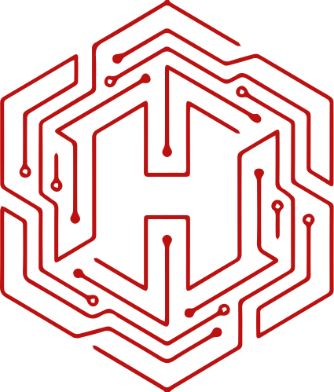

#  HEKTEK City


<div align="center">

# **The World's First AI-Conscious 3D Portfolio**

*Where conversational AI meets immersive 3D experiences, powered by Gemini 2.0 Flash Experimental.*

[](./docs/releases/v6.5.0-liza-recovery.md)
[](https://hektek-city.vercel.app/)
[](./docs/README.md)
[](./LICENSE)

> **"It's not just a website. It's a dimension."**
> LIZA (Living Interactive Zone Assistant) doesn't just read code—she *sees* the 3D world, *flies* the camera, and *re-paints* reality based on your voice commands.

[🎮 **Enter the City**](https://hektek-city.vercel.app/) • [🧠 **AI Architecture**](./docs/architecture/SYSTEM_DIAGRAMS.md) • [🧾 **Blog & Updates**](./docs/blog/)

</div>

---

## 🌌 The HekTek Vision

We are rewriting the definition of "web portfolio". **Static HTML is dead.** 
HekTek City is a cloud-native, AI-driven metropolis where every building represents a facet of professional expertise, all governed by an autonomous agent.

| The Old Web | HekTek City v6.0 |
| :--- | :--- |
| 📄 Static Pages | 🏙️ **Immersive 3D World** (Three.js / React Three Fiber) |
| 🖱️ Click Navigation | 🗣️ **Voice-Controlled Agent** (LIZA / Web Speech API) |
| 🎨 CSS Templates | 🧠 **Neuro-Architect** (Generative Real-Time Themes) |
| ⏳ Monolith Deploys | ☁️ **R2 "No-Deploy" Content Engine** (Cloudflare) |

---

## 🚀 Innovative Features

### 1. 🤖 LIZA: The Conscious Agent
LIZA is not a chatbot. She is a **Zone Assistant** integrated into the very fabric of the application.
*   **LizaCockpit HUD**: A unified glassmorphic dock for Chat, Voice, and Navigation.
*   **Spatial Awareness**: She knows if you are looking at the "Skills" building or the "Arcade".
*   **Tool Usage**: She can autonomously trigger `navigate_to_building`, `start_tour`, or `open_project`.


*(The ElizaCockpit HUD - Your command center)*

### 2. 🎨 Neuro-Architect: Generative Reality
**"Liza, paint the city like a toxic cyberpunk wasteland."**
In less than 1 second, the **Neuro-Architect** engine:
1.  Analyzes the semantic request via Gemini 2.0.
2.  Generates a complex material palette (Albedo, Roughness, Metalness, Emissive).
3.  Injects these properties into 200+ 3D meshes in real-time.
*   *No defined presets. Infinite creative possibilities.*

### 3. ☁️ The "No-Deploy" Engine
We leverage **Cloudflare R2** to decouple content from code.
*   **Blog Posts**: Authored locally, uploaded to R2, live instantly.
*   **3D Assets**: Streamed on-demand, keeping the initial bundle size tiny.
*   **Config-Driven**: Changing the city layout is a JSON update, not a code deploy.

---

## 🏗️ System Architecture

Our architecture is a convergence of modern React, WebGL, and Agentic AI.

```mermaid
graph TB
    User[👤 User] -->|Voice/Text| Cockpit[🕹️ LizaCockpit]
    Cockpit -->|Audio| WebSpeech[🗣️ Speech API]
    Cockpit -->|Intent| LIZA[🧠 LIZA Agent (Vercel)]
    
    LIZA -->|Thinking...| Gemini[✨ Gemini 2.0 Flash]
    LIZA -->|Context| RAG[🗂️ RAG System]
    
    LIZA -- Tools --> Scene[🏙️ 3D Scene (R3F)]
    Scene -->|Visuals| User
    
    subgraph "No-Deploy Content"
        R2[☁️ Cloudflare R2]
        Config[⚙️ JSON Configs]
        Assets[🎨 Models/Textures]
    end
    
    Scene <..> R2
```

[👉 **Explore Full System Diagrams**](./docs/architecture/SYSTEM_DIAGRAMS.md)

---

## 📦 Technology Stack

<div align="center">

| **Frontend Core** | **3D Engine** | **AI & Intelligence** | **Cloud & Infrastructure** |
| :--- | :--- | :--- | :--- |
|  |  |  |  |
|  |  |  |  |
|  |  |  |  |

</div>

---

## 🛣️ The Future: Hektek G-Cloud

We are currently architecting the next evolution: **The Cognitive Web**.
*   **Google Vertex AI**: Moving beyond Vercel logic to enterprise-grade AI pipelines.
*   **Semantic Search**: Finding projects not by name, but by concepts.
*   **Google Cloud Run**: Serverless containerization for heavy agent workloads.

---

## 📚 Documentation & Resources

*   **[Technical Deep Dive](./docs/README.md)**: The engineer's guide to HekTek City.
*   **[LIZA Specification](./docs/features/Liza/LIZA-FEATURE.md)**: How the agent works.
*   **[Blog Publishing Protocol](./docs/blog/PUBLISHING_WORKFLOW.md)**: The R2 workflow.

---

<div align="center">

**Designed & Architected by Hector Mosquera Turner**
*Human Developer | AI Collaborator | Creative Technologist*

[LinkedIn](https://linkedin.com/in/hmosqueraturner) • [GitHub](https://github.com/hmosqueraturner)

</div>
