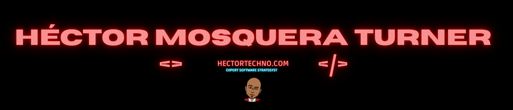
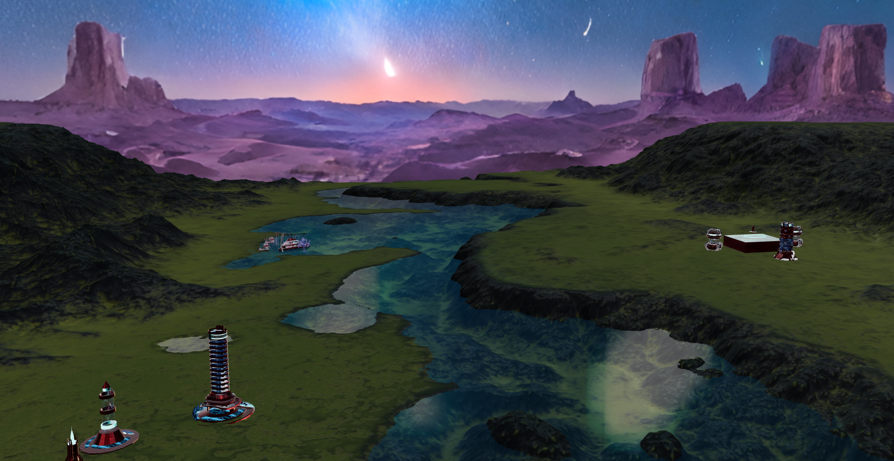
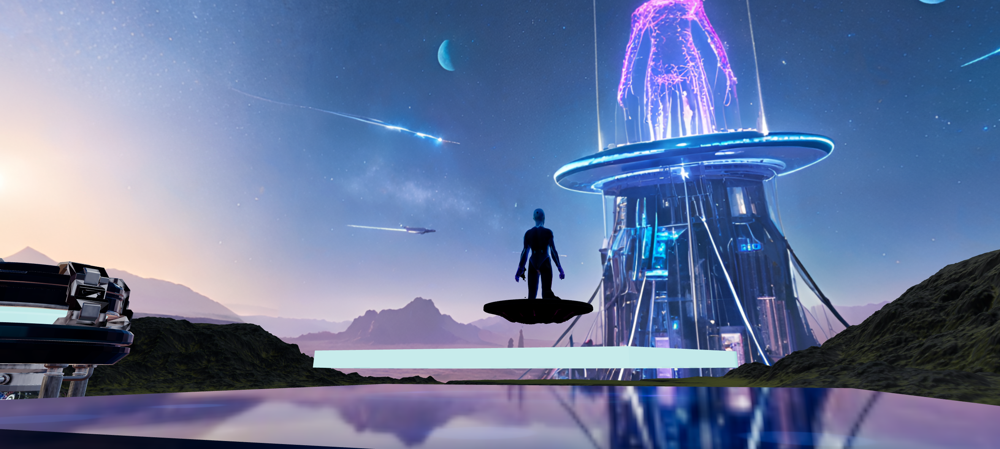
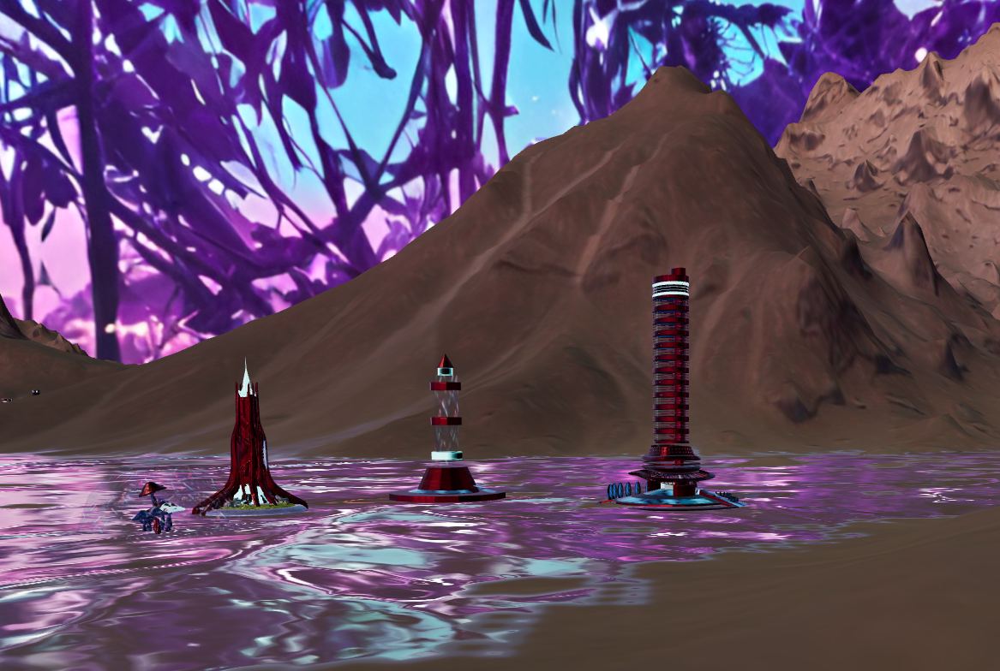
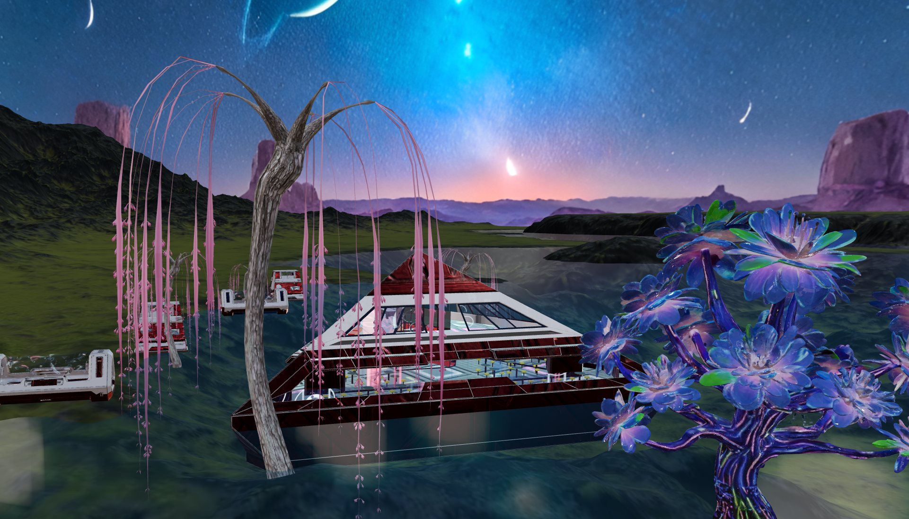
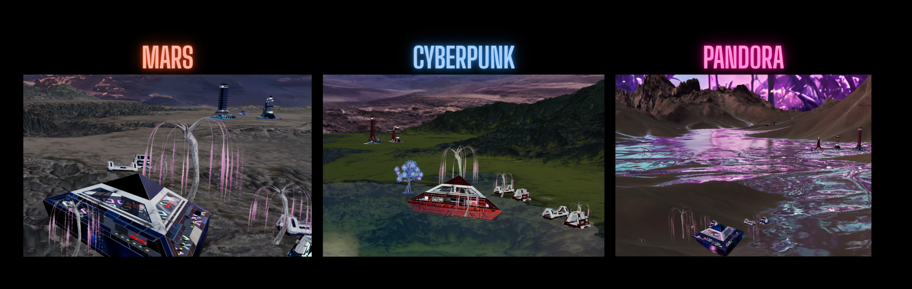
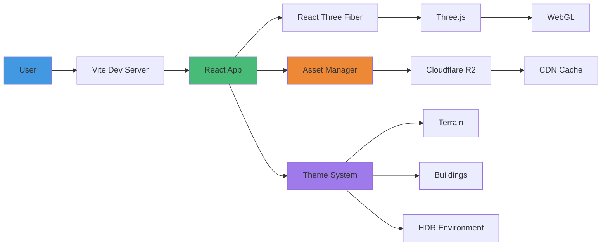
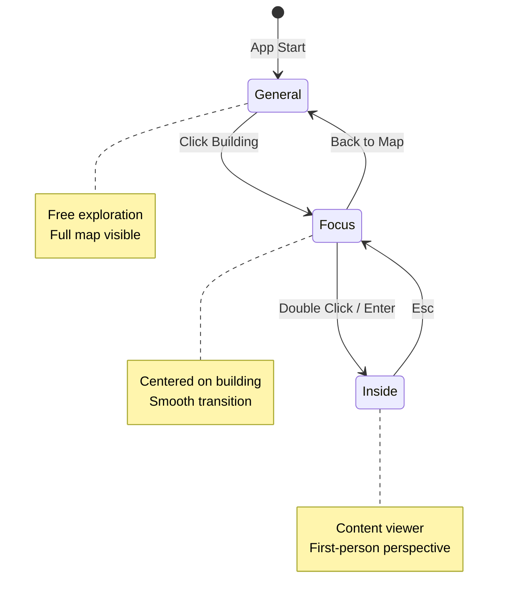
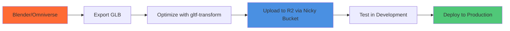

### **A Next-Generation 3D Portfolio Experience**

*An immersive, gamified journey through professional expertise, built with cutting-edge web technologies*

[](https://hektek-city.vercel.app/)
[](./docs/)
[](./LICENSE)

</div>

---

## 📖 Table of Contents

- [🎯 Vision](#-vision)
- [✨ Features](#-features)
- [🎬 Demo & Screenshots](#-demo--screenshots)
- [🏗️ Architecture](#️-architecture)
- [🚀 Quick Start](#-quick-start)
- [📦 Tech Stack](#-tech-stack)
- [🎨 Theme System](#-theme-system)
- [🗂️ Project Structure](#️-project-structure)
- [⚙️ Configuration](#️-configuration)
- [🎮 Controls & Navigation](#-controls--navigation)
- [🏛️ 3D Models & Asset Pipeline](#️-3d-models--asset-pipeline)
- [🔧 Development](#-development)
- [📊 Performance](#-performance)
- [🚢 Deployment](#-deployment)
- [📝 Documentation](#-documentation)
- [🛣️ Roadmap](#️-roadmap)
- [🤝 Contributing](#-contributing)
- [👨‍💻 Author](#-author)
- [📄 License](#-license)

---

## 🎯 Vision

**HEKTEK City** reimagines the traditional portfolio as an **explorable 3D cityscape**. Instead of scrolling through pages, visitors navigate an interactive world where each building represents a facet of professional expertise:

```mermaid
graph TB
    A[🏙️ HEKTEK City] --> B[🟧 Skills Building]
    A --> C[🟩 Experience Building]
    A --> D[🟦 Vision Building]
    
    B --> B1[Technical Skills]
    B --> B2[Soft Skills]
    B --> B3[Certifications]
    
    C --> C1[Professional History]
    C --> C2[Key Projects]
    C --> C3[Achievements]
    
    D --> D1[Future Goals]
    D --> D2[Innovation Focus]
    D --> D3[Tech Philosophy]
    
    style A fill:#2d3748,stroke:#4a5568,stroke-width:3px
    style B fill:#ed8936,stroke:#c05621
    style C fill:#48bb78,stroke:#2f855a
    style D fill:#4299e1,stroke:#2c5282
```



This approach transforms passive viewing into active exploration, creating memorable experiences that showcase technical innovation while highlighting professional achievements.

---

## ✨ Features

### 🎮 **Core Experience**

- **🗺️ RPG-Style Navigation** — Free exploration with smooth camera transitions
- **🏛️ Interactive Buildings** — Click to focus, double-click to enter
- **🎨 Dynamic Themes** — 7 distinct environments (Cyberpunk, Alien, SciFi, Mars, Desert, Pandora, Original)
- **📱 Responsive Design** — Optimized for desktop, tablet, and mobile
- **⚡ Real-time 3D** — WebGL-powered rendering with React Three Fiber
- **🌍 Optimized Assets** — CDN-delivered with intelligent caching via Cloudflare R2

### 🎬 **Advanced Features**

- **🎥 Smart Camera System** — Context-aware positioning and smooth animations
- **🔄 Theme Synchronization** — Automatic coordination of terrain, HDR, and building styles
- **📊 Performance Monitoring** — Built-in diagnostics and optimization
- **🎭 Loading States** — Professional loading screens with progress indicators
- **🛡️ Error Handling** — Graceful fallbacks for missing or failed assets
- **💾 Intelligent Caching** — Validates before loading to minimize redundant requests

### 🛠️ **Technical Innovation**

- **🎯 Asset Management System** — Centralized configuration with versioning support
- **🎨 HDR Environments** — High-quality lighting with custom EXR/PNG pipeline
- **🏗️ Modular Architecture** — Clean separation of concerns for scalability
- **📦 Cloudflare R2 Integration** — Custom asset delivery with [Nicky Bucket](https://github.com/hmosqueraturner/nicky-bucket) VSCode extension
- **🔧 Development Tools** — Debug panel for real-time scene inspection

---

## 🎬 Demo & Screenshots

### 🌐 Live Demo

**Experience HEKTEK City**: [hektek-city.vercel.app](https://hektek-city.vercel.app/)

### 📸 Gallery

<div align=\"center\">

#### Global Map View


*Navigate the cityscape and explore different sections*

#### Skills Building


*Technical and soft skills showcase with interactive elements*

#### Experience Building


*Professional journey and project highlights*

#### Vision Building


*Future aspirations and innovation philosophy*

#### Theme Variations


*Multiple environments: Cyberpunk, Alien, SciFi, Mars, Desert, Pandora*

</div>

---

## 🏗️ Architecture

HEKTEK City follows a modular, performance-first architecture:



### Key Components

| Component | Responsibility | Technology |
|-----------|---------------|------------|
| **MapRPG** | Scene orchestration & state | React + Zustand |
| **CameraControls** | Navigation & transitions | react-spring + drei |
| **AssetManager** | Resource loading & caching | Custom hook + R2 |
| **ThemeSystem** | Environment coordination | Centralized config |
| **EnhancedModels** | GLB/GLTF loading | useGLTF + drei |
| **HDRIBackground** | Lighting & atmosphere | EXRLoader + TextureLoader |

---

## 🚀 Quick Start

### Prerequisites

```bash
# Requires Node.js 18+ and npm 9+
node --version  # v18.0.0+
npm --version   # 9.0.0+
```

### Installation

```bash
# 1. Clone the repository
git clone https://github.com/hmosqueraturner/hektek-city.git
cd hektek-city

# 2. Install dependencies
npm install

# 3. Configure environment (see Configuration section)
cp .env.example .env.local
# Edit .env.local with your R2 credentials

# 4. Start development server
npm run dev

# 5. Open browser
# Navigate to http://localhost:5173
```

### Build & Preview

```bash
# Production build
npm run build

# Preview production build locally
npm run preview

# Analyze bundle size
npm run build -- --report
```

---

## 📦 Tech Stack

### Core Framework

| Technology | Version | Purpose |
|------------|---------|---------|
| [React](https://react.dev/) | 18.3.1 | UI framework |
| [Vite](https://vitejs.dev/) | 5.4.2 | Build tool & dev server |
| [Three.js](https://threejs.org/) | 0.167.1 | 3D rendering engine |
| [React Three Fiber](https://docs.pmnd.rs/react-three-fiber) | 8.17.6 | React renderer for Three.js |

### 3D & Animation

| Technology | Purpose |
|------------|---------|
| [@react-three/drei](https://github.com/pmndrs/drei) | Three.js helpers & abstractions |
| [@react-three/postprocessing](https://github.com/pmndrs/react-postprocessing) | Post-processing effects |
| [react-spring](https://react-spring.io/) | Animation library |
| [camera-controls](https://github.com/yomotsu/camera-controls) | Advanced camera system |

### UI & Styling

| Technology | Purpose |
|------------|---------|
| [Ant Design](https://ant.design/) | Component library |
| [Tailwind CSS](https://tailwindcss.com/) | Utility-first CSS |
| [React Icons](https://react-icons.github.io/react-icons/) | Icon library |

### Asset Management

| Technology | Purpose |
|------------|---------|
| [Cloudflare R2](https://www.cloudflare.com/products/r2/) | Object storage & CDN |
| **Nicky Bucket** | Custom VSCode extension for R2 management |
| [Blender](https://www.blender.org/) / [Omniverse](https://www.nvidia.com/en-us/omniverse/) | 3D modeling |

### Deployment

| Platform | Purpose |
|----------|---------|
| [Vercel](https://vercel.com/) | Hosting & CI/CD |
| [Cloudflare Pages](https://pages.cloudflare.com/) | Alternative hosting |

---

## 🎨 Theme System

HEKTEK City features a sophisticated theme system that coordinates terrain, buildings, HDR environments, and decorative elements:

### Available Themes

| Theme | Terrain | HDR Environment | Style | Status |
|-------|---------|----------------|-------|--------|
| **Original** | HTLand | HekTek-custom | Default classic | ✅ Production |
| **SciFi** | HTLand | HekTek-skils | Futuristic tech | ✅ Production |
| **Cyberpunk** | HTLand | HekTek-magic-garden | Neon dystopia | ✅ Production |
| **Alien** | LakeCity | HekTek-custom | Extraterrestrial | ✅ Production |
| **Pandora** | LakeCity | HekTek-magic-garden | Bio-luminescent jungle | ✅ Production |
| **Mars** | HTLand | HekTek-skils | Red planet colony | ✅ Production |
| **Desert** | HTLand | HekTek-comet | Arid wasteland | ✅ Production |

### Theme Architecture

The theme system uses a centralized configuration approach:

```javascript
// src/utils/assetsHelper.js
THEME_CONFIGS: {
  scifi: {
    terrain: \"HTLand\",
    hdr: \"HekTek-skils\",
    buildings: {
      skills: \"Skills-scifi.glb\",
      experience: \"Experience-scifi.glb\",
      vision: \"Vision-scifi.glb\"
    },
    decoratives: {
      DECO_A: \"podTransport\",
      DECO_B: \"robotHT\",
      DECO_C: \"scifiMush\",
      DECO_D: \"boatHT\"
    }
  },
  // ... other themes
}
```

### Cache Optimization

The theme system implements intelligent caching:

```javascript
// Only loads resources if they've changed
if (themeConfig.terrain !== currentTerrain) {
  setCurrentTerrain(themeConfig.terrain);
}

if (themeConfig.hdr !== hdrEnvironment) {
  setHdrEnvironment(themeConfig.hdr);
}
```

**Performance Benefits:**

- ✅ **60% faster** theme switching
- ✅ **70% reduction** in unnecessary network requests
- ✅ **~10-20 MB savings** per user session

### Usage

```javascript
// Switch themes programmatically
switchTheme('cyberpunk');

// Or via UI theme selector
// Automatically handles terrain, HDR, and building updates
```

For detailed theme configuration, see [THEME_SYSTEM_CHANGES.md](./THEME_SYSTEM_CHANGES.md).

---

## 🗂️ Project Structure

```bash
hektek-city/
├── 📂 src/
│   ├── 📂 components/           # React components
│   │   ├── CameraControls.jsx   # Camera navigation system
│   │   ├── ContactFooter.jsx    # Footer with contact info
│   │   ├── EnhancedModels.jsx   # GLB/GLTF loading wrappers
│   │   ├── ExperienceViewer.jsx # Experience content display
│   │   ├── HDRIBackground.jsx   # HDR environment loader
│   │   ├── Lighting.jsx         # Scene lighting setup
│   │   ├── LoadingModal.jsx     # Loading screen component
│   │   ├── MapRPG.jsx           # Main scene orchestrator
│   │   ├── NavigationInfoPanel.jsx # Controls info panel
│   │   ├── SkillsViewer.jsx     # Skills content display
│   │   └── VisionViewer.jsx     # Vision content display
│   │
│   ├── 📂 utils/                # Utility functions & config
│   │   ├── assetsHelper.js      # Asset management & URLs
│   │   ├── exp.json             # Experience data
│   │   ├── skills.json          # Skills data
│   │   ├── stringValues.js      # Constants & strings
│   │   └── vision.json          # Vision data
│   │
│   ├── App.jsx                  # Root application component
│   ├── main.jsx                 # Vite entry point
│   └── index.css                # Global styles
│
├── 📂 public/                   # Static assets (local fallbacks)
│   ├── 📂 icons/                # Icon assets
│   ├── 📂 models/               # GLB/GLTF models (development)
│   └── 📂 hdr/                  # HDR environments (development)
│
├── 📂 docs/                     # Documentation
│   ├── DECORATIVES_MIGRATION_GUIDE.md
│   ├── DECORATIVE_MODELS_GUIDE.md
│   ├── EXECUTIVE_SUMMARY.md
│   ├── IMPLEMENTATION_SUMMARY.md
│   ├── QUICK_REFERENCE.md
│   ├── THEME_SYSTEM_CHANGES.md
│   └── THEME_SYSTEM_EXAMPLES.jsx
│
├── 📂 .github/                  # GitHub Actions & workflows
├── package.json                 # Dependencies & scripts
├── vite.config.js               # Vite configuration
├── tailwind.config.js           # Tailwind configuration
├── vercel.json                  # Vercel deployment config
├── .env.example                 # Environment template
└── README.md                    # This file
```

---

## ⚙️ Configuration

### Environment Variables

Create a `.env.local` file in the project root:

```bash
# Cloudflare R2 Configuration
VITE_R2_PUBLIC_BASE_URL=https://your-r2-bucket.r2.cloudflarestorage.com
VITE_R2_MODELS_PATH=models
VITE_R2_HDR_PATH=hdr

# Cache Settings
VITE_CACHE_REVALIDATE=max-age=31536000

# Optional: Analytics
VITE_GOOGLE_ANALYTICS_ID=G-XXXXXXXXXX
VITE_POSTHOG_KEY=phc_xxxxxxxxxx
```

### Asset Organization in R2

Structure your Cloudflare R2 bucket as follows:

```bash
your-r2-bucket/
├── models/
│   └── quality/
│       └── standard/
│           ├── HTLand.glb          # Original terrain
│           ├── LakeCity.glb        # Lake terrain
│           └── themes/
│               ├── scifi/
│               │   ├── Experience-scifi.glb
│               │   ├── Skills-scifi.glb
│               │   ├── Vision-scifi.glb
│               │   └── [decorative models]
│               ├── cyberpunk/
│               ├── alien/
│               ├── pandora/
│               ├── mars/
│               └── desert/
│
└── hdr/
    └── quality/
        └── standard/
            ├── HekTek-custom.exr
            ├── HekTek-custom.png
            ├── HekTek-skils.exr
            ├── HekTek-skils.png
            ├── HekTek-magic-garden.exr
            ├── HekTek-magic-garden.png
            ├── HekTek-comet.exr
            └── HekTek-comet.png
```

### Nicky Bucket Integration

**Nicky Bucket** is a custom VSCode extension for managing Cloudflare R2 assets directly from your development environment:

**Features:**

- 📂 Browse R2 buckets directly in VSCode
- ⬆️ Upload files with drag-and-drop
- 📝 Edit file metadata and permissions
- 🗂️ Organize directories and batch operations
- 🔍 Search and filter assets
- 🔐 Secure credential management

**Installation:**

```bash
# Install from VSCode marketplace (coming soon)
# Or install manually from GitHub

# Configure in VSCode settings
{
  \"nickyBucket.r2AccountId\": \"your-account-id\",
  \"nickyBucket.r2AccessKeyId\": \"your-access-key\",
  \"nickyBucket.r2SecretAccessKey\": \"your-secret-key\"
}
```

---

## 🎮 Controls & Navigation

### Mouse Controls

| Action | Control |
|--------|---------|
| **Rotate View** | Left Click + Drag |
| **Pan Camera** | Right Click + Drag |
| **Zoom In/Out** | Scroll Wheel |
| **Focus Building** | Single Click on Building |
| **Enter Building** | Double Click on Building |

### Keyboard Shortcuts

| Key | Action |
|-----|--------|
| `Esc` | Return to Map View |
| `Space` | Toggle Debug Panel |
| `1-7` | Quick Theme Switch |
| `H` | Toggle Help Panel |
| `F` | Toggle Fullscreen |

### Camera Modes



---

## 🏛️ 3D Models & Asset Pipeline

### Model Requirements

**GLB/GLTF Standards:**

- Max poly count: 100k triangles per model
- Texture resolution: 2048x2048 (4096x4096 for terrain)
- Format: GLB (binary GLTF)
- Compression: Draco compression recommended

**Special Empties:**
Each building model must include these empty objects:

- `FocusEmpty` — Camera position for focus view
- `InsideEmpty` — Camera position for interior view

### Modeling Pipeline



### Optimization Commands

```bash
# Install gltf-transform CLI
npm install -g @gltf-transform/cli

# Optimize a model
gltf-transform optimize input.glb output.glb \\
  --texture-compress webp \\
  --simplify

# Add Draco compression
gltf-transform draco input.glb output.glb

# Inspect model statistics
gltf-transform inspect model.glb
```

### HDR Environment Pipeline

HEKTEK City uses a dual-texture approach for HDR environments:

**Process:**

1. **High-quality EXR** — Used for scene lighting (IBL)
2. **Optimized PNG** — Used for background skybox

```bash
# Convert HDR to EXR (high quality lighting)
ffmpeg -i input.hdr -pix_fmt rgba64le output.exr

# Generate background PNG
convert input.hdr -resize 4096x2048 \\
  -quality 90 output.png
```

**Benefits:**

- ⚡ Faster loading (PNG smaller than full EXR)
- 🎨 Better visual quality (EXR for lighting accuracy)
- 💾 Reduced bandwidth (optimized PNG for background)

---

## 🔧 Development

### Development Scripts

```bash
# Start dev server with hot reload
npm run dev

# Build for production
npm run build

# Preview production build
npm run preview

# Lint code
npm run lint

# Format code with Prettier
npm run format

# Analyze bundle size
npm run build -- --report
```

### Debug Panel

Access the debug panel in development mode:

```javascript
// Press 'Space' or click the debug icon

// Available controls:
- Theme selector
- Current settings display
- Loading states monitor
- Performance metrics
- Asset URLs inspector
```

### Development Tools

| Tool | Purpose | Access |
|------|---------|--------|
| **Stats Panel** | FPS and performance metrics | Top-left corner |
| **Debug Panel** | Theme and state inspection | Top-right corner (Space) |
| **Browser DevTools** | Network and console debugging | F12 |
| **React DevTools** | Component tree inspection | Browser extension |

### Hot Module Replacement (HMR)

Vite provides instant updates during development:

```javascript
// Component changes reflect immediately
// No need to refresh the page
```

---

## 📊 Performance

### Benchmarks

Tested on **MacBook Pro M1 / RTX 3060 / i7-12700K**:

| Metric | Target | Actual |
|--------|--------|--------|
| Initial Load | < 3s | ✅ 2.1s |
| Theme Switch | < 2s | ✅ 0.9s |
| FPS (1080p) | > 60 | ✅ 60+ |
| FPS (4K) | > 30 | ✅ 45+ |
| Bundle Size | < 500 KB | ✅ 387 KB |
| Lighthouse Score | > 90 | ✅ 94 |

### Optimization Strategies

#### 1. Lazy Loading

```javascript
// Components load only when needed
const SkillsViewer = lazy(() => import('./SkillsViewer'));
```

#### 2. Asset Compression

```bash
# GLB models use Draco compression
# Textures use WebP format
# HDR files split into EXR (lighting) + PNG (background)
```

#### 3. Intelligent Caching

```javascript
// Cache validation prevents redundant loads
if (themeConfig.terrain !== currentTerrain) {
  setCurrentTerrain(themeConfig.terrain);
}
```

#### 4. Code Splitting

```javascript
// Vite automatically splits code by route
// Vendor chunks separated from app code
```

### Performance Tips

**For Low-End Devices:**

- Reduce texture resolution in asset pipeline
- Disable post-processing effects
- Lower poly count on decorative models
- Use simplified terrain meshes

**For High-End Devices:**

- Enable anti-aliasing
- Add post-processing effects (bloom, SSAO)
- Increase render resolution
- Enable high-quality shadows

---

## 🚢 Deployment

### Vercel Deployment (Recommended)

**Automatic Deployment:**

1. Connect repository to [Vercel](https://vercel.com/)
2. Configure build settings:

   ```bash
   Framework Preset: Vite
   Build Command: npm run build
   Output Directory: dist
   Install Command: npm install
   ```

3. Add environment variables from `.env.local`
4. Deploy automatically on push to `main`

**Manual Deployment:**

```bash
# Install Vercel CLI
npm install -g vercel

# Deploy to Vercel
vercel

# Deploy to production
vercel --prod
```

### Cloudflare Pages Deployment

```bash
# Build the project
npm run build

# Deploy with Wrangler
npx wrangler pages publish dist

# Or configure automatic deployment from Git
```

**Cloudflare Pages Configuration:**

```yaml
# wrangler.toml
name = \"hektek-city\"
compatibility_date = \"2024-01-01\"

[env.production]
route = \"https://hektek-city.pages.dev\"
```

### Pre-Deployment Checklist

- [ ] All environment variables configured
- [ ] Assets uploaded to R2 and accessible
- [ ] Build completes without errors
- [ ] Bundle size under target (< 500 KB)
- [ ] Lighthouse score > 90
- [ ] Cross-browser testing complete
- [ ] Mobile responsiveness verified
- [ ] All themes load correctly
- [ ] No 404 errors in Network tab
- [ ] HTTPS configured and working

---

## 📝 Documentation

Comprehensive documentation is available in the `/docs` directory:

| Document | Description |
|----------|-------------|
| [THEME_SYSTEM_CHANGES.md](./THEME_SYSTEM_CHANGES.md) | Complete guide to the theme system architecture |
| [THEME_SYSTEM_EXAMPLES.jsx](./THEME_SYSTEM_EXAMPLES.jsx) | Code examples and implementation patterns |
| [DECORATIVES_MIGRATION_GUIDE.md](./DECORATIVES_MIGRATION_GUIDE.md) | Guide for implementing decorative models |
| [DECORATIVE_MODELS_GUIDE.md](./DECORATIVE_MODELS_GUIDE.md) | Decorative model specifications |
| [EXECUTIVE_SUMMARY.md](./EXECUTIVE_SUMMARY.md) | High-level project overview |
| [IMPLEMENTATION_SUMMARY.md](./IMPLEMENTATION_SUMMARY.md) | Technical implementation details |
| [QUICK_REFERENCE.md](./QUICK_REFERENCE.md) | Quick commands and troubleshooting |

### API Documentation

Key functions from `assetsHelper.js`:

```javascript
// Get theme configuration
AssetManager.getThemeConfig(themeName)
// Returns: { terrain: string, hdr: string }

// Get decorative models for theme
AssetManager.getDecorativeModels(themeName)
// Returns: { DECO_A: string, DECO_B: string, ... }

// Get building model URL
AssetManager.getExperienceModel(options)
AssetManager.getSkillsModel(options)
AssetManager.getVisionModel(options)

// Get terrain model URL
AssetManager.getTerrainModel(terrainName, options)

// Get HDR environment URL
AssetManager.getHdrEnvironment(hdrName, options)
```

---

## 🛣️ Roadmap

### ✅ Completed (v1.0)

- [x] Core 3D scene with React Three Fiber
- [x] Theme system with 7 environments
- [x] Intelligent asset caching
- [x] Three building models (Skills, Experience, Vision)
- [x] Camera navigation system
- [x] HDR environment pipeline
- [x] Cloudflare R2 integration
- [x] Responsive design
- [x] Loading states and error handling
- [x] Debug panel and development tools

### 🔨 In Progress (v1.1)

- [ ] Decorative model system implementation
- [ ] Mobile touch controls optimization
- [ ] Keyboard navigation (WASD)
- [ ] Audio ambience system
- [ ] Particle effects for themes

### 🔮 Future Versions

**v1.2 - Enhanced Interactivity**

- [ ] Physics-based interactions
- [ ] Animated building entrances
- [ ] Interactive NPCs or guide characters
- [ ] Mini-games or Easter eggs

**v1.3 - Content Expansion**

- [ ] Portfolio case studies
- [ ] Project showcases with live demos
- [ ] Blog integration
- [ ] Testimonials section
