# 🏗️ HekTek City: System Architecture Diagrams

This document visually details the complex interactions within the HekTek City ecosystem, from the React Event Loop to the AI Neural-Architecture.

## 1. 🧠 Core Event Loop (The "Consciousness")

How LIZA perceives and reacts to the user's input in the 3D world.

## 2. ☁️ R2 "No-Deploy" Content Engine

The architecture that allows content updates without code deployments.

```mermaid
graph TD
    subgraph "Local Development (Authoring)"
        Dev["👨‍💻 Hector"]
        Docs["📄 Markdown Blog Posts"]
        Assets["🎨 3D Models / Textures"]
        Json["⚙️ Config JSONs"]
    end

    subgraph "Cloud Infrastructure"
        R2["☁️ Cloudflare R2 Bucket"]
        Vercel["▲ Vercel Edge Runtime"]
    end

    subgraph "Client Runtime"
        Browser["🌍 User Browser"]
        Hook["🪝 useRemoteConfig"]
    end

    Dev -- Uploads --> R2
    Docs --> R2
    Assets --> R2
    Json --> R2

    Browser -- Requests App --> Vercel
    Vercel -- Serves bundle --> Browser

    Browser -- Fetches Content --> R2
    Hook -- "https://r2.hektek.io/..." --> R2
    
    style R2 fill:#f6821f,stroke:#fff,stroke-width:2px,color:#fff
    style Vercel fill:#000,stroke:#fff,stroke-width:2px,color:#fff
```

## 3. 🧩 Component Hierarchy (LizaCockpit Integration)

How the UI overlays the 3D world.

```mermaid
graph TB
    App[App.jsx]
    
    subgraph "Canvas Layer (Z-Index: 0)"
        R3F[Canvas]
        Scene[MapRPG Scene]
        Cam[CameraControls]
    end
    
    subgraph "UI Layer (Z-Index: 10)"
        Layout["ViewerLayout"]
        Cockpit["🕹️ LizaCockpit"]
    end
    
    App --> R3F
    App --> Layout
    
    Layout --> Cockpit
    R3F --> Scene
    R3F --> Cam
    
    Cockpit -- Controls --> Cam
    Cockpit -- Updates --> Scene
    
    classDef ui fill:#1a365d,stroke:#4299e1,color:#fff
    classDef scene fill:#276749,stroke:#48bb78,color:#fff
    
    class Cockpit,Layout ui
    class Scene,Cam scene
```

