# HEKTEK City - Comprehensive Documentation


## **A Next-Generation 3D Portfolio Experience**

### *An immersive, gamified journey through professional expertise, built with cutting-edge web technologies*

[](./docs/releases/v4.0.0.md)
[](https://hektek-city.vercel.app/)
[](./docs/)
[](./LICENSE)

---

## 📖 Table of Contents

- [🎯 Vision](#-vision)
- [✨ Features](#-features)
- [🎬 Demo & Screenshots](#-demo--screenshots)
- [🏗️ Architecture](#️-architecture)
- [🚀 Quick Start](#-quick-start)
- [📦 Tech Stack](#-tech-stack)
- [🎨 Theme System](#-theme-system)
- [🗂️ Project Structure](#️-project-structure)
- [⚙️ Configuration](#️-configuration)
- [🎮 Controls & Navigation](#-controls--navigation)
- [🏛️ 3D Models & Asset Pipeline](#️-3d-models--asset-pipeline)
- [📝 Documentation](#-documentation)
- [🛣️ Roadmap](#️-roadmap)
- [🤝 Contributing](#-contributing)
- [👨‍💻 Author](#-author)
- [📄 License](#-license)

---

## 🎯 Vision

**HEKTEK City** reimagines the traditional portfolio as an **explorable 3D cityscape**. Instead of scrolling through pages, visitors navigate an interactive world where each building represents a facet of professional expertise:

```mermaid
graph TB
    A[🏙️ HEKTEK City] --> B[🟧 Skills Building]
    A --> C[🟩 Experience Building]
    A --> D[🟦 Vision Building]
    A --> E[🕹️ Projects Arcade]
    
    B --> B1[Technical Skills]
    B --> B2[Soft Skills]
    B --> B3[Certifications]
    
    C --> C1[Professional History]
    C --> C2[Key Projects]
    C --> C3[Achievements]
    
    D --> D1[Future Goals]
    D --> D2[Innovation Focus]
    D --> D3[Tech Philosophy]

    E --> E1[Interactive 3D Demos]
    E --> E2[R2 Asset Integration]
    
    style A fill:#2d3748,stroke:#4a5568,stroke-width:3px
    style B fill:#ed8936,stroke:#c05621
    style C fill:#48bb78,stroke:#2f855a
    style D fill:#4299e1,stroke:#2c5282
    style E fill:#805ad5,stroke:#553c9a
```



This approach transforms passive viewing into active exploration, creating memorable experiences that showcase technical innovation while highlighting professional achievements.

---

## ✨ Features

- [x] **Immersive 3D World:** RPG-style navigation with smooth camera controls.
- [x] **Cockpit Console:** ⭐ NEW v3.2 - Centralized control hub for navigation, themes, and settings.
- [x] **Projects Arcade:** ⭐ NEW v3.3 - Standalone 3D environment for showcasing interactive projects.
- [x] **Guided Tours:** ⭐ NEW v3.0 - Cinematic tours that guide users through the portfolio with "Inside" views.
- [x] **Theme System:** Switch between 7 unique environmental themes (Cyberpunk, Mars, Pandora, etc.).
- [x] **Runtime Materials Engine:** Modify building materials in real-time (<1ms) without reloading models.
- [x] **Cloud-Native Assets:** Powered by **Cloudflare R2** with local fallback for offline dev.
- [x] **LOD Terrain System:** Progressive loading (2K → 4K) for instant start-up.
- [x] **Unified Cyberpunk UI:** Cohesive "Glassmorphism" aesthetic across all panels.
- [x] **Full Mobile Support:** Optimized touch controls and performance tuning.
- [x] **JSON Configuration (SSOT):** Centralized architecture for zero-downtime updates.

### 🎮 **Core Experience**

- **🗺️ RPG-Style Navigation** — Free exploration with smooth camera transitions.
- **🕹️ Cockpit Controls** — Unified interface for all interactions.
- **🏛️ Interactive Buildings** — Click to focus, enter to view content.
- **🎨 Dynamic Themes** — 7 distinct environments.
- **⚡ Real-time 3D** — WebGL-powered rendering with React Three Fiber (React 19).
- **🌍 Optimized Assets** — CDN-delivered via Cloudflare R2.

### 🛠️ **Technical Innovation**

- **🎯 SSOT Architecture** — Single Source of Truth via JSON configs.
- **📦 R2 Integration** — Custom `useRemoteConfig` hook for hybrid local/remote data.
- **🏗️ Modular Architecture** — Clean separation of concerns (MapRPG, ProjectsConsole, Cockpit).
- **🔧 React 19 & Vite 7** — Cutting-edge stack for maximum performance.
- **🎨 Runtime Materials** — JSON-driven material changes without pipeline rebuilds.

---

## 🎬 Demo & Screenshots

### 🌐 Live Demo

**Experience HEKTEK City**: [hektek-city.vercel.app](https://hektek-city.vercel.app/)

### 📸 Gallery

<div align="center">

#### Global Map View

*Navigate the cityscape and explore different sections*

#### Cockpit Console

*Centralized control hub for navigation and settings*

#### Projects Arcade

*Immersive 3D environment for project showcases*

#### Theme Variations

*Multiple environments: Cyberpunk, Alien, SciFi, Mars, Desert, Pandora*

</div>

---

## 🏗️ Architecture

HEKTEK City follows a modular, performance-first architecture with clear separation of concerns:

```mermaid
graph TB
    A[User Interface] --> B[React App Layer]
    B --> C[3D Rendering Layer]
    B --> D[State Management]
    B --> E[Asset Management]

    subgraph "UI System"
        A1[CockpitConsole]
        A2[ViewerLayout]
        A3[CreativeIcons]
    end

    A --> A1
    A --> A2
    A --> A3

    subgraph "3D Scenes"
        C1[MapRPG (City)]
        C2[ProjectsConsole (Arcade)]
        C3[BlogScene]
    end

    C --> C1
    C --> C2
    C --> C3

    D --> H[Camera State]
    D --> I[Theme State]
    D --> J[Tour State]

    E --> K[Cloudflare R2]
    E --> L[Local Fallback]

    B --> M[Custom Hooks]
    M --> N[useRemoteConfig]
    M --> O[useTour]
    M --> P[useDynamicMaterials]

    style A fill:#4299e1
    style B fill:#48bb78
    style C fill:#ed8936
    style E fill:#9f7aea
    style M fill:#f6ad55
    style A1 fill:#BB1111,stroke:#fff,stroke-width:2px
    style C2 fill:#00F0FF,stroke:#fff,stroke-width:2px
```

### Key Components (v3.3.0)

| Component | Responsibility | Technology |
|-----------|---------------|------------|
| **MapRPG** | Main city scene orchestration | React + R3F |
| **CockpitConsole** | Centralized UI control hub | React + AntD |
| **ProjectsConsole** | Standalone 3D Arcade scene | React + R3F |
| **useRemoteConfig** | Hybrid R2/Local data fetching | Custom Hook |
| **useTour** | Guided tour logic & camera control | Custom Hook |
| **CameraControls** | Physics-based camera movement | drei + custom logic |
| **ViewerLayout** | Standardized content viewer wrapper | React + CSS |
| **CreativeIcons** | Custom SVG icon system | React + SVG |

---

## 🚀 Quick Start

### Prerequisites

```bash
# Requires Node.js 18+ and npm 9+
node --version  # v18.0.0+
npm --version   # 9.0.0+
```

### Installation

```bash
# 1. Clone the repository
git clone https://github.com/hmosqueraturner/hektek-city.git
cd hektek-city

# 2. Install dependencies
npm install

# 3. Configure environment
cp .env.example .env.local
# Edit .env.local with your R2 credentials (optional for local dev)

# 4. Start development server
npm run dev

# 5. Open browser
# Navigate to http://localhost:5173
```

### Build & Preview

```bash
# Production build
npm run build

# Preview production build locally
npm run preview
```

---

## 📦 Tech Stack

### Core Framework

| Technology | Version | Purpose |
|------------|---------|---------|
| [React](https://react.dev/) | 19.1.1 | UI framework |
| [Vite](https://vitejs.dev/) | 7.1.3 | Build tool & dev server |
| [Three.js](https://threejs.org/) | 0.179.1 | 3D rendering engine |
| [React Three Fiber](https://docs.pmnd.rs/react-three-fiber) | 9.3.0 | React renderer for Three.js |

### 3D & Animation

| Technology | Purpose |
|------------|---------|
| [@react-three/drei](https://github.com/pmndrs/drei) | Three.js helpers & abstractions |
| [@react-three/postprocessing](https://github.com/pmndrs/react-postprocessing) | Post-processing effects |
| [react-spring](https://react-spring.io/) | Animation library |
| [framer-motion](https://www.framer.com/motion/) | UI animations |

### UI & Styling

| Technology | Purpose |
|------------|---------|
| [Ant Design](https://ant.design/) | Component library |
| [Tailwind CSS](https://tailwindcss.com/) | Utility-first CSS |
| [React Icons](https://react-icons.github.io/react-icons/) | Icon library |

### Infrastructure

| Technology | Purpose |
|------------|---------|
| [Cloudflare R2](https://www.cloudflare.com/products/r2/) | Object storage & CDN |
| [Vercel](https://vercel.com/) | Hosting & CI/CD |

---

## 🎨 Theme System

HEKTEK City features a sophisticated theme system that coordinates terrain, buildings, HDR environments, and decorative elements.

### Available Themes

| Theme | Style | Status |
|-------|-------|--------|
| **Original** | Default classic | ✅ Production |
| **SciFi** | Futuristic tech | ✅ Production |
| **Cyberpunk** | Neon dystopia | ✅ Production |
| **Alien** | Extraterrestrial | ✅ Production |
| **Pandora** | Bio-luminescent jungle | ✅ Production |
| **Mars** | Red planet colony | ✅ Production |
| **Desert** | Arid wasteland | ✅ Production |

---

## 🗂️ Project Structure

```bash
hektek-city/
├── 📂 src/
│   ├── 📂 components/                # React components
│   │   ├── CockpitConsole.jsx        # ⭐ NEW: Main control hub
│   │   ├── ProjectsConsole.jsx       # ⭐ NEW: 3D Arcade scene
│   │   ├── MapRPG.jsx                # Main City scene
│   │   ├── CameraControls.jsx        # Camera logic
│   │   ├── ExperienceViewer.jsx      # Content viewers
│   │   ├── SkillsViewer.jsx
│   │   ├── VisionViewer.jsx
│   │   ├── ViewerLayout.jsx          # Shared viewer layout
│   │   ├── CreativeIcons.jsx         # Icon system
│   │   └── ...
│   │
│   ├── 📂 hooks/                     # Custom Hooks
│   │   ├── useRemoteConfig.js        # ⭐ NEW: R2 data fetching
│   │   ├── useTour.js                # ⭐ NEW: Tour logic
│   │   ├── useDynamicMaterials.js    # Material engine
│   │   └── ...
│   │
│   ├── 📂 config/                    # JSON Configurations
│   │   ├── content-sources.json      # ⭐ NEW: R2 sources
│   │   ├── tours-config.json         # ⭐ NEW: Tour steps
│   │   ├── theme-config.json         # Theme definitions
│   │   ├── buildings-config.json     # Building metadata
│   │   └── ...
│   │
│   ├── 📂 utils/                     # Utilities
│   │   ├── stringValues.js           # Constants
│   │   └── ...
│   │
│   ├── App.jsx                       # Root component
│   └── main.jsx                      # Entry point
│
├── 📂 public/                        # Static assets (local fallbacks)
├── 📂 docs/                          # Documentation
└── package.json
```

---

## ⚙️ Configuration

### Environment Variables

Create a `.env.local` file:

```bash
# Cloudflare R2 Configuration
VITE_R2_PUBLIC_BASE_URL=https://your-r2-bucket.r2.cloudflarestorage.com
VITE_R2_MODELS_PATH=models
VITE_R2_HDR_PATH=hdr

# Feature Flags
VITE_USE_LOCAL_CONFIG=true  # Force local JSON fallback for dev
```

### Content Sources (`content-sources.json`)

Controls where data is fetched from (Remote vs Local):

```json
{
  "contentSources": {
    "configs": {
      "baseUrl": "https://r2.hektek.io/configs",
      "enabled": true
    }
  }
}
```

---

## 🎮 Controls & Navigation

### Cockpit Console (New in v3.2)

The **Cockpit Console** is the central hub for all interactions:
- **Navigation**: Jump to specific buildings.
- **Themes**: Switch environments instantly.
- **Tours**: Start guided experiences.
- **Settings**: Adjust graphics and audio.

### Mouse & Keyboard

| Action | Control |
|--------|---------|
| **Rotate View** | Left Click + Drag |
| **Pan Camera** | Right Click + Drag |
| **Zoom** | Scroll Wheel |
| **Interact** | Click on Buildings / UI |
| **Return to Orbit** | `Esc` or Cockpit Button |

---

## 📝 Documentation

For deeper technical details, please refer to the `/docs` directory:

- **[🏗️ Architecture](./docs/ARCHITECTURE.md)**
- **[🚀 Deployment](./docs/DEPLOYMENT.md)**
- **[🎨 Branding](./docs/BRANDING.md)**
- **[📜 Releases](./docs/releases/)**

---

## 🛣️ Roadmap

- **[v4.0.0] "Imoto" Release (Current)**
    - Full public launch.
    - CockpitConsole, ProjectsConsole, R2 Integration.
    - Performance finalization.

---

## 🤝 Contributing

1.  Fork the repo.
2.  Create your feature branch (`git checkout -b feature/amazing-feature`).
3.  Commit your changes (`git commit -m 'Add some amazing feature'`).
4.  Push to the branch (`git push origin feature/amazing-feature`).
5.  Open a Pull Request.

---

## 👨‍💻 Author

**Hector Mosquera Turner**
*CTO & AI Architect*

[Portfolio](https://hektek-city.vercel.app/) • [LinkedIn](https://linkedin.com/in/hmosqueraturner) • [GitHub](https://github.com/hmosqueraturner)

---

## 📄 License

Distributed under the MIT License. See `LICENSE` for more information.
