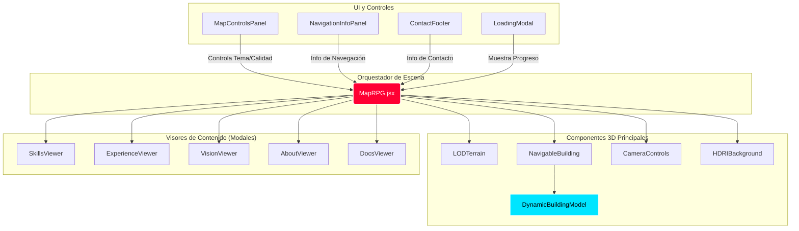
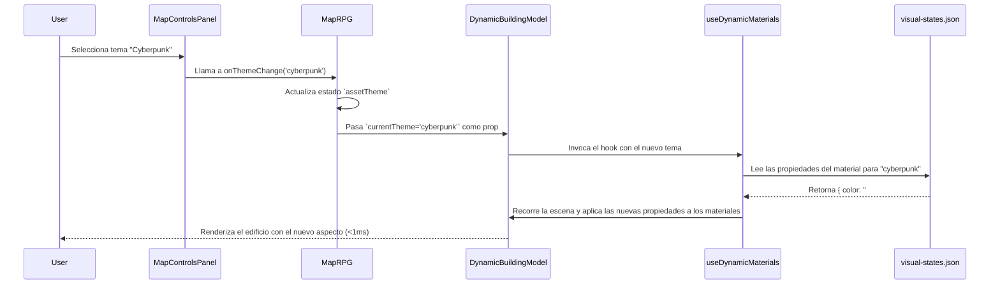

#  HEKTEK-CITY: Análisis de Arquitectura y Estado de Componentes (Fase III)

**Fecha:** 2025-11-20
**Autor:** Gemini Code Assist
**Propósito:** Este documento proporciona un análisis detallado de la arquitectura de componentes actualmente en uso en el proyecto **hektek-city**, partiendo del orquestador principal `MapRPG.jsx`. El objetivo es clarificar qué componentes son centrales, cuáles han sido deprecados o reemplazados, y cuáles están huérfanos, para facilitar el mantenimiento y futuras expansiones.

---

## 1. Diagrama de Arquitectura Principal

El siguiente diagrama ilustra la relación entre los componentes clave que conforman la experiencia principal de la aplicación. `MapRPG` actúa como el núcleo que orquesta la escena 3D, la interfaz de usuario y la lógica de estado.

---

## 2. Estado de los Componentes

### ✅ Componentes Activos y Centrales

Estos son los componentes que forman el núcleo de la aplicación funcional:

| Componente | Rol Principal | Notas |
| :--- | :--- | :--- |
| **`MapRPG.jsx`** | **Orquestador Principal.** Gestiona el estado global (tema, calidad, sección actual), la lógica de la cámara y renderiza todos los elementos de la escena. | Es el corazón de la aplicación. |
| **`DynamicBuildingModel.jsx`** | **Modelo 3D Dinámico.** Carga los modelos `.glb` y aplica materiales en runtime usando el hook `useDynamicMaterials`. Es la pieza central del sistema de temas. | Reemplaza a cargadores de modelos anteriores. Robusto y eficiente. |
| **`LODTerrain.jsx`** | **Terreno con Nivel de Detalle.** Carga una versión de baja calidad del terreno y la actualiza a una de alta calidad en segundo plano. Utiliza `DynamicBuildingModel` internamente. | Estrategia de rendimiento clave. |
| **`MapControlsPanel.jsx`** | **Panel de Control de UI.** Permite al usuario cambiar de tema y calidad de terreno. Su estilo está unificado con la estética cyberpunk. | Componente de interacción principal. |
| **`NavigableBuilding.jsx`** | **Navegación a Escenas.** Envuelve a los edificios que redirigen a otras páginas (como `/blog`) y gestiona la animación de la cámara antes de la transición. | Usa `useNavigate` de React Router para una navegación SPA correcta. |
| **`*Viewer.jsx`** | **Visores de Contenido.** (Skills, Experience, Vision, About, Docs). Muestran la información detallada en modales con el estilo cyberpunk unificado. | Son el contenido principal del portafolio. |
| **`HDRIBackground.jsx`** | **Entorno e Iluminación.** Carga los archivos `.exr` y `.png` para la iluminación y el fondo visual de la escena. | Crítico para la atmósfera visual. |
| **`CameraControls.jsx`** | **Control de Cámara.** Gestiona la lógica de movimiento de la cámara (general, foco, interior) de forma suave. | Esencial para la experiencia de exploración. |
| **`WorldEvolution.jsx`** | **SVG Animado.** Componente de alto impacto visual que muestra una narrativa de evolución. Integrado en `VisionViewer`. | Demuestra habilidades avanzadas en diseño SVG y animación. |
| **`BlogScene.jsx`** | **Página de Contenido.** Una escena completa que demuestra la carga de contenido desde JSON, video, iframes y más. | Un excelente ejemplo de página de contenido rica. |

### ⚠️ Componentes Deprecados o Reemplazados

Estos archivos existen en el proyecto pero su funcionalidad ha sido reemplazada por sistemas más nuevos y eficientes. **Se recomienda su eliminación.**

| Componente | Razón de Deprecación | Reemplazado por |
| :--- | :--- | :--- |
| **`SkillsViewer_OLD.jsx`** | Versión antigua sin el estilo cyberpunk unificado. | `SkillsViewer.jsx` |
| **`EnhancedModels.jsx`** | Sistema de carga de modelos anterior. Su lógica de fallback y manejo de errores fue integrada y mejorada. | `DynamicBuildingModel.jsx` y su robusto sistema de carga. |
| **`AdvancedBuildingModel.jsx`** | Un experimento para manejar variantes `KHR_materials_variants`. El sistema actual de materiales en runtime es más flexible. | `DynamicBuildingModel.jsx` y el hook `useDynamicMaterials`. |
| **`ModelLoader.jsx`** | Un cargador de modelos muy básico de las primeras etapas del proyecto. | `DynamicBuildingModel.jsx`. |

### ❓ Componentes Huérfanos o No Utilizados

Estos componentes existen en el directorio pero no son importados ni utilizados por el flujo principal que parte de `MapRPG.jsx`. **Se recomienda su eliminación para limpiar el codebase.**

| Componente | Observaciones |
| :--- | :--- |
| **`MapLake.jsx`** | Parece ser una escena alternativa o una versión anterior del mapa principal. No está conectada a la navegación actual. |
| **`UIOverlay.jsx`** | Un componente de UI que parece haber sido reemplazado por los paneles de control y modales actuales. |
| **`MapRPG_Integration_Example.jsx`** | Un archivo de ejemplo para integraciones. Su propósito es instructivo y no forma parte de la aplicación en producción. |

---

## 3. Flujo de Datos: Sistema de Materiales en Runtime

Este diagrama ilustra cómo un cambio de tema en la UI se traduce en una actualización visual instantánea en los modelos 3D, una de las características técnicas más potentes del proyecto.

---

## 4. Resumen y Recomendaciones

-   **Arquitectura Sólida:** El proyecto tiene una arquitectura modular y bien definida. El uso de componentes como `DynamicBuildingModel` y `LODTerrain`, junto con el hook `useDynamicMaterials`, demuestra un alto nivel de madurez técnica.
-   **Estilo Consistente:** La estética "Cyberpunk" se ha aplicado de manera efectiva y consistente a través de todos los componentes visuales, creando una experiencia de usuario inmersiva.
-   **Código Limpio:** La mayoría del código activo sigue buenas prácticas de React.

**Recomendaciones:**

1.  **Eliminar Archivos Obsoletos:** Proceder con la eliminación de los componentes listados en las secciones "Deprecados" y "Huérfanos". Esto reducirá la deuda técnica y simplificará el proyecto para futuros desarrolladores.
2.  **Centralizar Estilos:** Considerar la extracción del objeto `COLORS` y otros estilos comunes (como `sectionStyle`, `headerStyle`) a un archivo de utilidades de estilo para evitar la repetición en cada componente "Viewer".
3.  **Documentar `visual-states.json`:** Crear un documento simple en la carpeta `/docs` que explique la estructura de `visual-states.json` y cómo añadir nuevos temas o modificar los existentes. Esto es crucial para la mantenibilidad del sistema de temas.

Este análisis confirma que **hektek-city** es un proyecto robusto, innovador y bien estructurado, listo para ser presentado como una pieza central de tu marca profesional.