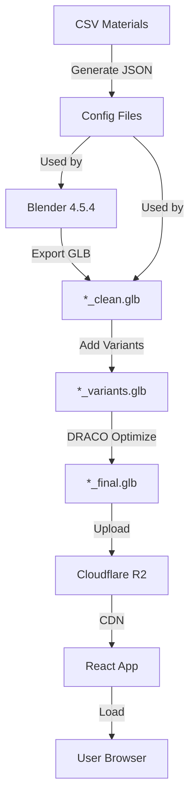
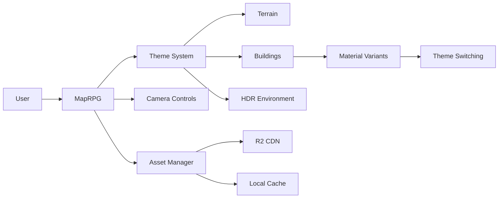

# 🏗️ Technical Documentation

In-depth technical documentation for HekTek City's architecture and implementation.

## 📚 Available Documentation

### [Pipeline Overview](./pipeline-overview.md)
Comprehensive overview of the Material Variants Pipeline system.

**Topics covered:**
- Complete pipeline architecture
- Material roles and variants system
- glTF KHR_materials_variants extension
- Blender addon technical details
- Processing scripts internals
- React integration

**Audience:** Developers working on the pipeline

---

### [Implementation Summary](./implementation-summary.md)
Technical details of key features and implementations.

**Topics covered:**
- Theme system implementation
- Asset management architecture
- Performance optimizations
- React component structure
- State management

**Audience:** Application developers

---

### [Executive Summary](./executive-summary.md)
High-level project overview for stakeholders.

**Topics covered:**
- Project goals and vision
- Key features and capabilities
- Technical stack
- Performance metrics
- Development roadmap

**Audience:** Project managers, stakeholders, new contributors

---

## 🎯 Documentation by Role

### For Application Developers

**Start here:**
1. [Executive Summary](./executive-summary.md) - Understand the project
2. [Implementation Summary](./implementation-summary.md) - Learn the architecture
3. [Main README](../../README.md#architecture) - Review component structure

**Deep dives:**
- [Theme System](../features/theme-system.md)
- [Asset Management](../../README.md#asset-management)
- React component source code

---

### For Pipeline Developers

**Start here:**
1. [Pipeline Overview](./pipeline-overview.md) - Understand the pipeline
2. [Workflow Documentation](../pipeline/WORKFLOW_AUTOMATED.md) - Learn the process
3. [Tools Documentation](../../tools/README.md) - Explore the tools

**Deep dives:**
- [Blender Addon Internals](../../tools/blender/addons/README.md#technical-details)
- [GLTF Processing](../../tools/gltf/README.md#technical-details)
- Source code in `tools/`

---

### For 3D Artists

**Start here:**
1. [Executive Summary](./executive-summary.md) - Project overview
2. [Blender Addon Guide](../../tools/blender/addons/README.md) - How to use the addon
3. [Quick Start](../pipeline/QUICK_START_AUTOMATED.md) - Quick workflow

**Resources:**
- [Model Requirements](../../README.md#model-requirements)
- [Optimization Guidelines](../../README.md#optimization-commands)
- [Testing Guide](../guides/testing-variants.md)

---

### For DevOps / Infrastructure

**Start here:**
1. [Executive Summary](./executive-summary.md) - Project overview
2. [Deployment Guide](../../README.md#deployment) - Deployment options
3. [Performance Metrics](../../README.md#performance) - Benchmarks

**Resources:**
- [Configuration](../../README.md#configuration)
- [Environment Variables](../../README.md#environment-variables)
- [Asset Organization](../../README.md#asset-organization-in-r2)

---

## 🔧 System Architecture

### High-Level Overview



### Component Architecture



---

## 📊 Technical Specifications

### Performance Targets

| Metric | Target | Current | Status |
|--------|--------|---------|--------|
| Initial Load | < 3s | 2.1s | ✅ |
| Theme Switch | < 2s | 0.9s | ✅ |
| FPS (1080p) | > 60 | 60+ | ✅ |
| Bundle Size | < 500 KB | 387 KB | ✅ |
| Lighthouse | > 90 | 94 | ✅ |

### Technology Stack

**Frontend:**
- React 18.3.1
- Vite 5.4.2
- Three.js 0.167.1
- React Three Fiber 8.17.6

**3D Pipeline:**
- Blender 4.5.4
- Python 3.8+
- Node.js 18+
- gltf-transform

**Infrastructure:**
- Cloudflare R2 (Storage)
- Vercel (Hosting)
- GitHub Actions (CI/CD)

---

## 🔍 Technical Deep Dives

### Material Variants System

**Architecture:**
```
CSV → JSON Config → Blender Addon → GLB Export →
Add Variants → DRACO Optimize → Production GLB
```

**Key Technologies:**
- KHR_materials_variants (glTF extension)
- Blender Python API
- Node.js gltf-transform
- DRACO mesh compression

**Documentation:**
- [Pipeline Overview](./pipeline-overview.md)
- [Blender Tools](../../tools/blender/README.md)
- [GLTF Pipeline](../../tools/gltf/README.md)

---

### Theme System

**Architecture:**
```
Theme Config → Asset URLs → Loading → Caching →
Render → Theme Switch → Validate Cache → Update
```

**Key Technologies:**
- Centralized configuration (assetsHelper.js)
- Intelligent caching
- React state management
- Three.js scene management

**Documentation:**
- [Theme System Guide](../features/theme-system.md)
- [Implementation Summary](./implementation-summary.md)

---

### Asset Management

**Architecture:**
```
Cloudflare R2 → CDN → Browser Cache →
useGLTF Hook → Three.js Loader → Scene
```

**Key Technologies:**
- Cloudflare R2 object storage
- drei useGLTF hook
- Three.js GLTFLoader
- DRACOLoader

**Documentation:**
- [Asset Management](../../README.md#asset-management)
- [R2 Configuration](../../README.md#asset-organization-in-r2)

---

## 📐 API Reference

### Asset Helper Functions

**Located:** `src/utils/assetsHelper.js`

```javascript
// Theme configuration
AssetManager.getThemeConfig(themeName)
// Returns: { terrain: string, hdr: string }

// Building models
AssetManager.getExperienceModel(options)
AssetManager.getSkillsModel(options)
AssetManager.getVisionModel(options)

// Terrain
AssetManager.getTerrainModel(terrainName, options)

// HDR Environments
AssetManager.getHdrEnvironment(hdrName, options)
```

**Options:**
```javascript
{
  quality: 'standard' | 'low_res',
  version: string,  // cache-busting
  fallback: boolean  // use fallback if primary fails
}
```

---

### Pipeline Scripts API

**Process All Buildings:**
```bash
node tools/pipeline/process-all-buildings.js
```

**Add Variants:**
```bash
node tools/gltf/add-khr-variants.js <input> <config> <output>
```

**Optimize:**
```bash
node tools/gltf/optimize-glb.js <input> <output> [--draco] [--quality n]
```

**Documentation:**
- [Pipeline Scripts](../../tools/pipeline/README.md)
- [GLTF Tools](../../tools/gltf/README.md)

---

## 🧪 Testing & Quality

### Unit Testing
**Status:** 🔜 Planned

**Scope:**
- Asset helper functions
- Theme configuration validation
- Material mapping logic

---

### Integration Testing
**Status:** ✅ Manual testing via MapVariations component

**Coverage:**
- Building loading
- Theme switching
- Material variants
- Performance

**Guide:** [Testing Variants](../guides/testing-variants.md)

---

### Performance Testing

**Metrics tracked:**
- FPS (frames per second)
- Load times
- Theme switch time
- Bundle size
- Lighthouse score

**Benchmarks:** [Performance Section](../../README.md#performance)

---

## 📝 Code Standards

### JavaScript/React
- ESM modules (`import/export`)
- React Hooks (no class components)
- Functional programming patterns
- PropTypes or TypeScript (future)

### Python
- PEP 8 style guide
- Type hints (when applicable)
- Docstrings for all functions
- UTF-8 encoding for Windows compatibility

### Blender Addon
- bl_info metadata required
- Operator naming: `CATEGORY_OT_action`
- Panel naming: `CATEGORY_PT_name`
- Follow Blender Python API conventions

---

## 🔗 Related Documentation

### User Guides
- [Quick Reference](../guides/quick-reference.md)
- [Testing Guide](../guides/testing-variants.md)

### Pipeline
- [Quick Start](../pipeline/QUICK_START_AUTOMATED.md)
- [Workflow](../pipeline/WORKFLOW_AUTOMATED.md)

### Tools
- [Tools Overview](../../tools/README.md)
- [Blender Tools](../../tools/blender/README.md)
- [GLTF Pipeline](../../tools/gltf/README.md)

---

## 📚 External Technical Resources

### glTF
- [glTF 2.0 Specification](https://registry.khronos.org/glTF/specs/2.0/glTF-2.0.html)
- [KHR_materials_variants Spec](https://github.com/KhronosGroup/glTF/tree/main/extensions/2.0/Khronos/KHR_materials_variants)
- [gltf-transform CLI](https://gltf-transform.donmccurdy.com/)

### Blender
- [Blender Python API Reference](https://docs.blender.org/api/current/)
- [Addon Development](https://docs.blender.org/manual/en/latest/advanced/scripting/addon_tutorial.html)

### React/Three.js
- [React Three Fiber API](https://docs.pmnd.rs/react-three-fiber/api/canvas)
- [drei Helpers](https://github.com/pmndrs/drei)
- [Three.js Documentation](https://threejs.org/docs/)

---

**Last Updated:** 2025-11-18
