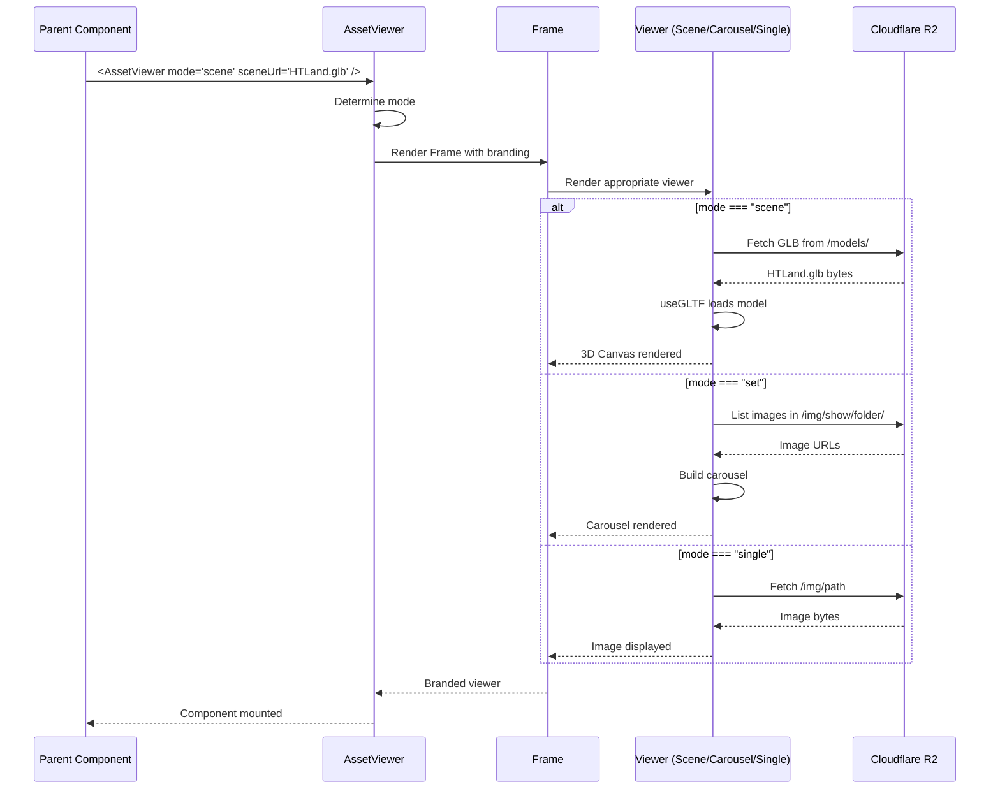

# AssetViewer Component - Analysis & Implementation Plan

**Date**: 2025-12-02  
**Mode**: PLANNING (Analysis Phase)  
**Status**: Awaiting User Approval

---

## 📋 Executive Summary

This document analyzes the creation of a new **AssetViewer** component - a branded, flexible viewer for R2 assets (GLB models, image sets, single images) with HEKTEK branding and glassmorphism aesthetic.

**Key Points**:
- ✅ Architecture review completed - existing patterns identified
- ✅ Visual mockups generated for 3 modes
- ✅ Technical design proposed
- ⏳ Pending user feedback on design decisions

---

## 🎯 Requirements Summary

### Functional Requirements

| Mode | Input | Behavior |
|------|-------|----------|
| **`scene`** | GLB file path | Render 3D model in small canvas |
| **`set`** | Image folder path | Display carousel of all images |
| **`single`** | Single image path | Display full-size image |

### Visual Requirements
- **Branding**: HEKTEK logo, CreativeIcons integration
- **Style**: Cyberpunk aesthetic (glassmorphism, neon borders)
- **Colors**: Cyan (#00F0FF) + Red (#BB1111)
- **Responsive**: Fill container without breaking parent

### Technical Requirements
- **Independence**: New component, no breaking changes
- **Reusability**: Can be imported anywhere
- **R2 Integration**: Use existing R2 utilities
- **3D Rendering**: Leverage existing GLB patterns

---

## 🏗️ Current Architecture Analysis

### 1. GLB Rendering Pattern (Used in 10+ Components)

**Found in**: `DynamicBuildingModel.jsx`, `ProjectsScene.jsx`, `EnhancedModels.jsx`

```javascript
// Standard pattern
import { useGLTF } from '@react-three/drei';
import { Canvas } from '@react-three/fiber';

function Model({ url }) {
  const { scene } = useGLTF(url);
  return <primitive object={scene} />;
}

// Usage
<Canvas>
  <Model url="https://assets.hectortechno.com/models/building.glb" />
</Canvas>
```

**Key Findings**:
- ✅ `@react-three/fiber` + `@react-three/drei` already in dependencies
- ✅ `useGLTF` hook handles loading + caching
- ✅ R3F `Canvas` provides WebGL context
- ✅ Pattern proven in 10+ production components

### 2. Image Carousel Pattern

**Found in**: `AboutMeScene.jsx`

```javascript
import { Carousel } from 'antd';

const carouselSettings = {
  autoplay: true,
  dots: true,
  infinite: true,
  speed: 500
};

<Carousel {...carouselSettings}>
  {images.map(img => (
    
  ))}
</Carousel>
```

**Key Findings**:
- ✅ Ant Design Carousel already in use
- ✅ Settings pattern established
- ✅ Responsive image loading working

### 3. R2 Asset Loading

**Found in**: `r2-utils.js`

```javascript
const R2_BASE_URL = 'https://assets.hectortechno.com';

// JSON files
fetchFromR2('exp.json')

// For GLB/images - direct URL construction
const glbUrl = `${R2_BASE_URL}/models/${filename}.glb`;
const imgUrl = `${R2_BASE_URL}/img/${folder}/${filename}.jpg`;
```

**Key Findings**:
- ✅ R2 base URL centralized
- ✅ Pattern: construct URLs, let browser cache
- ✅ CORS configured for all asset types

### 4. Branding System

**Found in**: `CreativeIcons.jsx`

```javascript
// 15+ animated SVG icons available
<AiBrainIcon size={40} color="#00F0FF" secondaryColor="#BB1111" />
<CloudPipelineIcon size={40} ... />
<DevOpsInfiniteIcon size={40} ... />
```

**Key Findings**:
- ✅ CreativeIcons component with 15+ icons
- ✅ All icons accept size, color, secondaryColor
- ✅ Animated SVG with cyberpunk aesthetic
- ✅ Can be embedded anywhere

---

## 🎨 Visual Design Mockups

### Mode 1: Scene Viewer (GLB)


**Features**:
- 3D Canvas with OrbitControls
- HEKTEK branding top-left
- Info bar bottom (file name, size)
- Glassmorphism card effect
- Neon cyan border glow

### Mode 2: Carousel Viewer (Image Set)


**Features**:
- Ant Design Carousel
- Navigation arrows (cyan)
- Dot indicators
- HEKTEK icon corner overlay
- Red glow accent

### Mode 3: Single Image Viewer


**Features**:
- Full-bleed image display
- Aspect ratio preserved
- Top bar with branding + title
- Minimal chrome
- Cyan border

---

## 📐 Technical Design Proposal

### Component Structure

```
src/components/AssetViewer/
├── AssetViewer.jsx          # Main component (mode switcher)
├── SceneViewer.jsx          # GLB rendering
├── CarouselViewer.jsx       # Image carousel
├── SingleImageViewer.jsx    # Single image
├── AssetViewerFrame.jsx     # Shared branded frame
└── index.js                 # Exports
```

### Component API

```typescript
<AssetViewer
  mode="scene" | "set" | "single"
  
  // For mode="scene"
  sceneUrl?: string           // e.g., "HTLand.glb"
  sceneFolder?: string        // e.g., "models" (default)
  
  // For mode="set"
  imageFolder?: string        // e.g., "show/project1"
  imageExtension?: string     // e.g., "jpg" (default)
  
  // For mode="single"
  imageUrl?: string           // e.g., "banner.png"
  imagePath?: string          // e.g., "img/banner.png"
  
  // Branding
  showLogo?: boolean          // default: true
  showIcon?: boolean          // default: true
  icon?: ReactElement         // default: <AiBrainIcon />
  title?: string              // Optional title text
  subtitle?: string           // Optional subtitle
  
  // Styling
  className?: string
  style?: CSSProperties
  width?: string | number     // default: "100%"
  height?: string | number    // default: "400px"
/>
```

### Implementation Architecture

```mermaid
graph TB
    subgraph "AssetViewer Component"
        Main[AssetViewer.jsx]
        Frame[AssetViewerFrame.jsx]
        
        Scene[SceneViewer.jsx]
        Carousel[CarouselViewer.jsx]
        Single[SingleImageViewer.jsx]
    end
    
    subgraph "Dependencies"
        R3F[React Three Fiber]
        Drei[@react-three/drei]
        AntD[Ant Design Carousel]
        Icons[CreativeIcons]
    end
    
    subgraph "Data Sources"
        R2[Cloudflare R2]
    end
    
    Main --> Frame
    Frame --> Scene
    Frame --> Carousel
    Frame --> Single
    
    Scene --> R3F
    Scene --> Drei
    Carousel --> AntD
    Single --> AntD
    
    Frame --> Icons
    
    Scene --> R2
    Carousel --> R2
    Single --> R2
    
    style Main fill:#00F0FF,color:#000
    style Frame fill:#BB1111,color:#fff
    style R2 fill:#f6821f,color:#fff
```

### Data Flow



---

## 💻 Proposed Implementation

### 1. AssetViewerFrame.jsx (Shared Frame)

```jsx
import React from 'react';
import { AiBrainIcon } from './CreativeIcons';

export function AssetViewerFrame({
  children,
  title,
  subtitle,
  showLogo = true,
  showIcon = true,
  icon = <AiBrainIcon />,
  className = '',
  style = {}
}) {
  return (
    <div 
      className={`asset-viewer-frame ${className}`}
      style={{
        position: 'relative',
        background: 'rgba(0, 0, 0, 0.6)',
        backdropFilter: 'blur(10px)',
        border: '1px solid rgba(0, 240, 255, 0.3)',
        borderRadius: '12px',
        boxShadow: '0 0 20px rgba(0, 240, 255, 0.2)',
        overflow: 'hidden',
        ...style
      }}
    >
      {/* Branding Header */}
      {(showLogo || showIcon || title) && (
        <div className="asset-viewer-header" style={{
          position: 'absolute',
          top: 0,
          left: 0,
          right: 0,
          zIndex: 10,
          background: 'linear-gradient(180deg, rgba(0,0,0,0.8) 0%, transparent 100%)',
          padding: '12px 16px',
          display: 'flex',
          alignItems: 'center',
          gap: '12px'
        }}>
          {showIcon && icon}
          {title && (
            <div>
              <div style={{
                color: '#00F0FF',
                fontFamily: 'Michroma',
                fontSize: '14px',
                fontWeight: 'bold'
              }}>
                {title}
              </div>
              {subtitle && (
                <div style={{
                  color: '#fff',
                  fontSize: '12px',
                  opacity: 0.7
                }}>
                  {subtitle}
                </div>
              )}
            </div>
          )}
        </div>
      )}
      
      {/* Content */}
      <div className="asset-viewer-content">
        {children}
      </div>
    </div>
  );
}
```

### 2. SceneViewer.jsx (GLB Mode)

```jsx
import React, { Suspense } from 'react';
import { Canvas } from '@react-three/fiber';
import { OrbitControls, useGLTF, Environment } from '@react-three/drei';

function Model({ url }) {
  const { scene } = useGLTF(url);
  return <primitive object={scene} scale={1} />;
}

export function SceneViewer({ sceneUrl, sceneFolder = 'models' }) {
  const R2_BASE = 'https://assets.hectortechno.com';
  const fullUrl = sceneUrl.startsWith('http') 
    ? sceneUrl 
    : `${R2_BASE}/${sceneFolder}/${sceneUrl}`;
  
  return (
    <Canvas
      camera={{ position: [5, 5, 5], fov: 50 }}
      style={{ width: '100%', height: '100%' }}
    >
      <Suspense fallback={null}>
        <Model url={fullUrl} />
        <OrbitControls enableDamping />
        <Environment preset="city" />
        <ambientLight intensity={0.5} />
        <directionalLight position={[10, 10, 5]} intensity={1} />
      </Suspense>
    </Canvas>
  );
}
```

### 3. CarouselViewer.jsx (Image Set Mode)

```jsx
import React, { useState, useEffect } from 'react';
import { Carousel } from 'antd';

export function CarouselViewer({ imageFolder, imageExtension = 'jpg' }) {
  const [images, setImages] = useState([]);
  const R2_BASE = 'https://assets.hectortechno.com';
  
  useEffect(() => {
    // TODO: Need a way to list files in R2 folder
    // Option 1: Maintain a JSON manifest (e.g., /img/show/project1/manifest.json)
    // Option 2: Backend API to list files
    
    // For now, expect explicit file list
    const manifest = require(`../../public/img/${imageFolder}/manifest.json`);
    const urls = manifest.files.map(f => `${R2_BASE}/img/${imageFolder}/${f}`);
    setImages(urls);
  }, [imageFolder]);
  
  return (
    <Carousel
      autoplay
      dots
      infinite
      style={{ width: '100%', height: '100%' }}
    >
      {images.map((url, i) => (
        <div key={i} style={{
          width: '100%',
          height: '100%',
          display: 'flex',
          alignItems: 'center',
          justifyContent: 'center'
        }}>
          
        </div>
      ))}
    </Carousel>
  );
}
```

### 4. SingleImageViewer.jsx

```jsx
import React from 'react';

export function SingleImageViewer({ imageUrl, imagePath }) {
  const R2_BASE = 'https://assets.hectortechno.com';
  const fullUrl = imageUrl || `${R2_BASE}/${imagePath}`;
  
  return (
    <div style={{
      width: '100%',
      height: '100%',
      display: 'flex',
      alignItems: 'center',
      justifyContent: 'center',
      padding: '20px'
    }}>
      
    </div>
  );
}
```

### 5. AssetViewer.jsx (Main Component)

```jsx
import React from 'react';
import { AssetViewerFrame } from './AssetViewerFrame';
import { SceneViewer } from './SceneViewer';
import { CarouselViewer } from './CarouselViewer';
import { SingleImageViewer } from './SingleImageViewer';

export function AssetViewer({
  mode,
  
  // Scene props
  sceneUrl,
  sceneFolder,
  
  // Carousel props
  imageFolder,
  imageExtension,
  
  // Single image props
  imageUrl,
  imagePath,
  
  // Branding
  showLogo = true,
  showIcon = true,
  icon,
  title,
  subtitle,
  
  // Styling
  className,
  style = {},
  width = '100%',
  height = '400px'
}) {
  const renderContent = () => {
    switch (mode) {
      case 'scene':
        return <SceneViewer sceneUrl={sceneUrl} sceneFolder={sceneFolder} />;
      
      case 'set':
        return <CarouselViewer imageFolder={imageFolder} imageExtension={imageExtension} />;
      
      case 'single':
        return <SingleImageViewer imageUrl={imageUrl} imagePath={imagePath} />;
      
      default:
        return <div>Invalid mode: {mode}</div>;
    }
  };
  
  return (
    <AssetViewerFrame
      title={title}
      subtitle={subtitle}
      showLogo={showLogo}
      showIcon={showIcon}
      icon={icon}
      className={className}
      style={{ width, height, ...style }}
    >
      {renderContent()}
    </AssetViewerFrame>
  );
}
```

---

## 🔍 Integration Points

### Where to Use This Component

Based on existing architecture, here are logical integration points:

#### 1. `AboutMeScene.jsx`
**Current**: Uses Ant Design Carousel directly  
**Enhancement**: Replace with `<AssetViewer mode="set" imageFolder="show/about" />`

#### 2. `ProjectsConsole.jsx`
**Current**: Renders GLB models manually  
**Enhancement**: Use `<AssetViewer mode="scene" sceneUrl="project.glb" />`

#### 3. Markdown Viewer (Future)
**Use Case**: Embed assets in documentation  
**Syntax**: `` → Auto-render AssetViewer

#### 4. LIZA Chat (Future)
**Use Case**: "Show me the HTLand model"  
**Response**: Render AssetViewer in chat overlay

---

## ⚠️ Technical Challenges & Solutions

### Challenge 1: Listing Files in R2 Folder

**Problem**: R2 doesn't provide directory listing API  
**Solutions**:
1. **Manifest Files** (Recommended)
   - Create `manifest.json` in each folder
   - Example: `/img/show/project1/manifest.json`
   ```json
   {
     "files": ["image1.jpg", "image2.jpg", "image3.jpg"]
   }
   ```
   - ✅ Simple, static, fast
   - ❌ Manual maintenance

2. **Backend API**
   - Create Vercel function to list R2 bucket
   - ✅ Dynamic, no manual work
   - ❌ Adds API dependency

**Recommendation**: Start with manifests, migrate to API if needed

### Challenge 2: Canvas Size Management

**Problem**: R3F Canvas needs explicit dimensions  
**Solution**:
- Parent `AssetViewerFrame` sets dimensions
- Canvas inherits `width: 100%`, `height: 100%`
- Responsive via parent container

### Challenge 3: GLB Loading Performance

**Problem**: Large GLB files slow initial load  
**Solutions**:
- ✅ `useGLTF` already handles caching
- ✅ R3F Suspense for loading states
- ✅ Consider lazy loading (load on scroll)

---

## 📊 Impact Assessment

### No Breaking Changes
- ✅ New component, isolated in `/components/AssetViewer/`
- ✅ No modifications to existing components (until explicitly imported)
- ✅ Uses existing dependencies (no new packages)

### Integration Effort

| Use Case | Effort | Benefit |
|----------|--------|---------|
| AboutMeScene | Low (30 min) | Cleaner code, consistent branding |
| ProjectsConsole | Medium (1h) | Reusable GLB viewer |
| Markdown | High (2-3h) | Rich documentation |
| LIZA | Medium (1-2h) | Visual asset responses |

### Dependencies

**Already Installed**:
- `@react-three/fiber`
- `@react-three/drei`
- `antd` (Ant Design)
- `react`

**No New Packages Required** ✅

---

## 🎯 Proposed File Structure

```
src/components/AssetViewer/
├── index.js                 # Export AssetViewer
├── AssetViewer.jsx          # Main component (56 lines)
├── AssetViewerFrame.jsx     # Branded frame (68 lines)
├── SceneViewer.jsx          # GLB rendering (32 lines)
├── CarouselViewer.jsx       # Image carousel (48 lines)
├── SingleImageViewer.jsx    # Single image (28 lines)
└── AssetViewer.css          # Optional styles (if needed)

Total: ~232 lines of code
```

---

## ❓ Critical Questions for User

Before implementation, I need clarification on:

### 1. Image Set Listing Strategy

**Question**: For `mode="set"`, how should we list files in an R2 folder?

**Options**:
- A) **Manifest files** - Create JSON file per folder with file list
- B) **Backend API** - Vercel function to query R2 bucket
- C) **Explicit prop** - User provides array of filenames

**My Recommendation**: Start with **Option C** (explicit), add manifest support later

```jsx
// Option C - Simple
<AssetViewer 
  mode="set"
  images={['img1.jpg', 'img2.jpg', 'img3.jpg']}
  imageFolder="show/project1"
/>
```

### 2. Logo/Banner Asset

**Question**: What asset should we use for HEKTEK logo/banner?

**Options**:
- A) Use existing logo from `/docs/assets/logo.svg`
- B) Create new banner asset
- C) Skip logo, use CreativeIcon only

**My Recommendation**: **Option C** for simplicity, can add logo later

### 3. Default Dimensions

**Question**: What should be the default width/height?

**Current Proposal**:
```jsx
width="100%"
height="400px"
```

Is this acceptable or prefer different defaults?

### 4. Where to Use First?

**Question**: Which integration should we do first for testing?

**Options**:
- A) Standalone demo page (`/components/AssetViewer/demo.jsx`)
- B) Replace carousel in `AboutMeScene.jsx`
- C) New Projects detail page
- D) Other location you specify

**My Recommendation**: **Option A** - Create demo page first

### 5. Additional Features?

**Question**: Any features I'm missing?

**Potential Additions**:
- Download button?
- Fullscreen toggle?
- Share link?
- Thumbnail grid (before carousel)?
- Play/pause for scene rotation?

---

## 📅 Implementation Timeline

**If approved**, estimated effort:

| Phase | Tasks | Time |
|-------|-------|------|
| **Phase 1: Core** | Frame + Viewers | 2-3 hours |
| **Phase 2: Integration** | Demo page | 1 hour |
| **Phase 3: Testing** | All 3 modes | 1 hour |
| **Phase 4: Documentation** | README + examples | 1 hour |
| **Total** | | **5-6 hours** |

---

## 🚀 Next Steps

1. **Review this analysis**
2. **Answer the 5 critical questions**
3. **Approve/modify the design**
4. **I create detailed implementation plan**
5. **Begin development**

---

## 📚 Related Documentation

- [CreativeIcons Component](../../src/components/CreativeIcons.jsx)
- [R2 Utilities](../../src/utils/r2-utils.js)
- [DynamicBuildingModel](../../src/components/DynamicBuildingModel.jsx) - GLB pattern reference
- [AboutMeScene](../../src/pages/AboutMeScene.jsx) - Carousel pattern reference

---

**Ready for your feedback!** 🎯
