# LIZA - Complete Architecture Documentation

**Living Interactive Zone Assistant**  
**Version**: 2.0 (Post-Fix)  
**Last Updated**: 2025-12-02

---

## 📋 Table of Contents

1. [Overview](#overview)
2. [Architecture Diagram](#architecture-diagram)
3. [Component Breakdown](#component-breakdown)
4. [Data Flow](#data-flow)
5. [Key Features](#key-features)
6. [Configuration Files](#configuration-files)
7. [Developer Guide](#developer-guide)
8. [Troubleshooting](#troubleshooting)

---

## Overview

LIZA is an AI-powered guide for HEKTEK City that combines:
- **Pre-established themes** (instant application via preprocessor)
- **Custom AI themes** (generated by Gemini API)
- **Smart navigation** (6 buildings with FOCUS/INSIDE modes)
- **Smart context loading** (lazy loading based on keywords)
- **Natural conversation** (powered by Gemini 2.0 Flash Exp)

### Core Philosophy

1. **Efficiency First**: Avoid API calls when possible (preprocessor)
2. **Smart Context**: Load only relevant data (keywords-based)
3. **Clean UX**: Hide technical details, show only meaningful responses
4. **Extensible**: Easy to add new themes, tools, and knowledge

---

## Architecture Diagram


---

## Component Breakdown

### 1. Frontend Components

#### `useLizaChat.js`
**Purpose**: Main hook for user interaction  
**Responsibilities**:
- Receive user messages
- Call preprocessor
- Execute direct actions OR call API
- Handle function calls from Gemini
- Display responses in chat UI
- **Filter tool results from history** (critical for context)

**Key Logic**:
```javascript
// Preprocessor check
const directAction = preprocessMessage(userMessage);
if (directAction && directAction.skipAPI) {
  // Execute directly, skip API
}

// Clean history before sending to API
const cleanHistory = messages.filter(msg => 
  msg.content !== LIZA_GREETING && !msg.isToolResult
);
```

#### `useLizaTour.js`
**Purpose**: Execute tool calls (navigation + themes)  
**Responsibilities**:
- Map Gemini function calls to actual functions
- Execute `navigate_to_building`
- Execute `apply_visual_theme`
- Return success/failure messages

**Tools Supported**:
- `navigate_to_building({building, mode})`
- `apply_visual_theme(themeData)`

#### `useAITheme.js`
**Purpose**: Apply themes (both pre-established and custom)  
**Responsibilities**:
- Handle `{themeName: "chernobyl"}` from preprocessor
- Handle `{styleName, primaryColor, ...}` from Gemini
- Load theme-config.json
- Apply theme to AIThemeContext

**Key Fix**:
```javascript
// SYNCHRONOUS import (critical!)
import themeConfig from '../../config/theme-config.json';

// No async/await issues
const theme = themeConfig.themes[themeName];
```

---

### 2. Backend Components

#### `api/liza/chat.js`
**Purpose**: Vercel Edge Function for Gemini API  
**Responsibilities**:
- Receive message + history
- Build smart context
- Call Gemini API
- **Extract both function calls AND text** (critical!)
- Stream responses

**Key Logic**:
```javascript
if (functionCalls && functionCalls.length > 0) {
  const textResponse = response.text(); // ✅ CRITICAL
  return JSON.stringify({ 
    functionCalls,
    textResponse  // ✅ Include text with function calls
  });
}
```

---

### 3. Utility Components

#### `liza-preprocessor.js`
**Purpose**: Detect theme keywords, skip API for instant themes  
**Process**:
1. Load `theme-config.json` + `theme-synonyms.json`
2. Build keyword map (runtime)
3. Check if message contains theme keywords
4. Return `{type: 'apply_visual_theme', args: {themeName}, skipAPI: true}`

**Keywords Supported**: 117 keywords → 13 themes

#### `liza-smart-context.js`
**Purpose**: Lazy load knowledge based on keywords  
**Process**:
1. Detect keywords in message
2. Map to data sources (skills.json, exp.json, etc.)
3. Load ONLY required JSONs
4. Format context for Gemini

**Data Sources**:
- `skills.json` (15KB)
- `exp.json` (16KB)
- `about.json` (4KB)
- `vision.json` (4KB)
- `docs.json` (5KB)
- `blog.json` (2KB)

#### `liza-tools.js`
**Purpose**: Define Gemini function declarations  
**Tools**:
```javascript
{
  navigate_to_building: {
    parameters: { building, mode }
  },
  apply_visual_theme: {
    parameters: { styleName, primaryColor, accentColor, ... }
  }
}
```

#### `liza-prompts.js`
**Purpose**: System prompt for Gemini  
**Contains**:
- Personality definition
- Tool usage examples
- Theme generation guidelines
- Response format instructions

---

## Data Flow

### Scenario 1: Theme Application (Preprocessor)

```mermaid
sequenceDiagram
    participant U as User
    participant C as useLizaChat
    participant P as Preprocessor
    participant T as useLizaTour
    participant A as useAITheme
    participant CTX as AIThemeContext
    participant UI as 3D Scene
    
    U->>C: "change to chernobyl"
    C->>P: preprocessMessage()
    P->>P: Detect "chernobyl" keyword
    P-->>C: {type: 'apply_visual_theme', themeName: 'chernobyl', skipAPI: true}
    C->>T: onToolCall({name: 'apply_visual_theme', args: {themeName}})
    T->>A: applyTheme({themeName: 'chernobyl'})
    A->>A: Load theme from theme-config.json
    A->>CTX: applyAITheme(fullThemeData)
    CTX->>UI: Re-render with new theme
    UI-->>U: Visual change (green Chernobyl theme)
    A-->>T: {success: true, message: '✨ Tema aplicado!'}
    T-->>C: result
    C->>UI: Add message (isToolResult: true)
    
    Note over C,P: ⚡ NO API CALL - Instant!
```



### Scenario 2: Navigation (Gemini API)


### Scenario 3: Content Question

```mermaid
sequenceDiagram
    participant U as User
    participant C as useLizaChat
    participant P as Preprocessor
    participant SC as Smart Context
    participant API as Gemini API
    participant UI as Chat UI
    
    U->>C: "cuéntame sobre React"
    C->>P: preprocessMessage()
    P-->>C: null
    C->>C: Filter history
    C->>API: POST {message, cleanHistory}
    API->>SC: buildSmartContext("cuéntame sobre React")
    SC->>SC: Detect "skills" keywords
    SC->>SC: Load skills.json
    SC-->>API: Context with React skills
    API->>API: Call Gemini
    API-->>C: SSE stream (text only, no function calls)
    C->>UI: Display streaming text
    UI-->>U: "React is a JavaScript library for..."
```



---

## Key Features

### 1. Pre-Established Themes (13 Total)

| Theme | Key | Primary Color | Description |
|-------|-----|---------------|-------------|
| Original HekTek | `default` | #4299e1 | Classic balanced aesthetic |
| SciFi Future | `scifi` | #00d4ff | Futuristic tech clean lines |
| Cyberpunk Neon | `cyberpunk` | #ff006e | Neon dystopia vibrant |
| Alien World | `alien` | #7209b7 | Extraterrestrial environment |
| Pandora Forest | `pandora` | #52c41a | Bio-luminescent jungle |
| Mars Colony | `mars` | #ff4d4f | Red planet colonial |
| Desert Wasteland | `desert` | #faad14 | Arid environment |
| Deep Ocean | `ocean` | #1e90ff | Underwater tech civilization |
| The Matrix | `matrix` | #00ff00 | Digital rain green phosphor |
| Golden Sunset | `sunset` | #ff8c00 | Warm evening colors |
| Industrial Complex | `industrial` | #8b4513 | Rusted metal factory |
| Tokyo Nights | `tokyo` | #ff1493 | Neon Japanese culture |
| Chernobyl Zone | `chernobyl` | #9ACD32 | Post-apocalyptic radioactive |

**Synonyms**: 117 keywords total (English + Spanish)  
**Example**: "ocean", "oceano", "sea", "underwater", "aquatic", "deep blue" → `ocean` theme

### 2. Smart Context Loading

**Keyword Categories**:
- `experience_keywords` → exp.json
- `skills_keywords` → skills.json
- `ai_keywords` → skills.json (AI subset)
- `about_keywords` → about.json
- `vision_keywords` → vision.json
- `docs_keywords` → docs.json
- `projects_keywords` → exp.json
- `blog_keywords` → blog.json

**Optimization**: Only loads relevant JSONs, reducing context size by ~70% on average

### 3. Navigation System

**Buildings**:
- Skills
- Experience
- Vision
- Projects (Arcade)
- About
- Docs

**Modes**:
- `FOCUS` - Orbit around building
- `INSIDE` - Enter building, show content

---

## Configuration Files

### `/src/config/theme-config.json`
**Purpose**: Define 13 pre-established themes  
**Structure**:
```json
{
  "themes": {
    "chernobyl": {
      "name": "Chernobyl",
      "displayName": "Chernobyl Zone",
      "terrain": "HTLand",
      "hdr": "HekTek-comet",
      "description": "Post-apocalyptic radioactive wasteland",
      "primaryColor": "#9ACD32",
      "enabled": true
    }
  }
}
```

### `/src/config/theme-synonyms.json`
**Purpose**: Map keywords to theme keys  
**Structure**:
```json
{
  "chern": ["chernobyl"],
  "chernobyl": ["chernobyl"],
  "radioactive": ["chernobyl"],
  "apocalypse": ["chernobyl"],
  ...
}
```

### `/config/keywords-map.json`
**Purpose**: Map keywords to content categories  
**Structure**:
```json
{
  "experience_keywords": ["experience", "work", "job", "company", ...],
  "skills_keywords": ["skill", "technology", "tools", ...]
}
```

### `/src/config/visual-states.json`
**Purpose**: Material properties per theme per building  
**Size**: 1334 lines, 37KB  
**Usage**: DynamicBuildingModel uses this for theme application

---

## Developer Guide

### Adding a New Theme

1. **Add to `theme-config.json`**:
```json
{
  "themes": {
    "mytheme": {
      "name": "MyTheme",
      "displayName": "My Amazing Theme",
      "primaryColor": "#FF5733",
      "enabled": true
    }
  }
}
```

2. **Add synonyms to `theme-synonyms.json`**:
```json
{
  "mytheme": ["mytheme"],
  "amazing": ["mytheme"],
  "awesome": ["mytheme"]
}
```

3. **Done!** Preprocessor will automatically detect

### Adding a New Tool

1. **Define in `liza-tools.js`**:
```javascript
export const LIZA_TOOLS = {
  my_new_tool: {
    name: "my_new_tool",
    description: "Does something cool",
    parameters: {
      type: "OBJECT",
      properties: {
        param1: { type: "STRING", description: "..." }
      },
      required: ["param1"]
    }
  }
};
```

2. **Handle in `useLizaTour.js`**:
```javascript
switch (toolCall.name) {
  case 'my_new_tool': {
    const { param1 } = toolCall.args;
    // Execute action
    return { success: true, message: "Done!" };
  }
}
```

3. **Update prompts in `liza-prompts.js**:
```javascript
export const LIZA_SYSTEM_PROMPT = `
...
TOOL USAGE EXAMPLES:
- User: "do something" → CALL my_new_tool({param1: "value"})
`;
```

### Testing Locally

```bash
# Start dev server
npm run dev

# Test preprocessor
"change to ocean"  # Should apply instantly

# Test navigation
"navega a Experience"  # Should move camera

# Test content
"cuéntame sobre React"  # Should respond about React skills
```

---

## Troubleshooting

### Theme Not Applying

**Symptom**: User says "change to X", nothing happens  
**Debug**:
1. Check console: `[Preprocessor] Keyword detected:`
2. If not detected, add synonym to `theme-synonyms.json`
3. If detected but not applied, check `useAITheme` logs

### Navigation Not Working

**Symptom**: User says "go to X", camera doesn't move  
**Debug**:
1. Check console: `[useLizaChat] Function calls: 1`
2. Check: `[useLizaTour] Calling onSetSection`
3. If onSetSection not callable, check MapRPG props

### Code/JSON in Chat

**Symptom**: Chat shows `{"functionCalls": ...}` instead of text  
**Debug**:
1. Check API response has `textResponse` field
2. Check `useLizaChat` is extracting `data.textResponse`
3. Check content-type is `application/json` when function calls present

### Gemini Confused / Wrong Responses

**Symptom**: Gemini talks about wrong topic or executes wrong function  
**Debug**:
1. Check history being sent: `[useLizaChat] Sending history:`
2. Verify `isToolResult` flag on tool confirmations
3. Check no "Tema aplicado" messages in history

### CORS Errors (Assets)

**Symptom**: GLB/HDR not loading from R2  
**Fix**:
1. Ensure dev server on port 5173: `http://localhost:5173`
2. Kill other `npm run dev` instances
3. Check R2 CORS config allows origin

---

## Performance Metrics

- **Theme Application**: <50ms (preprocessor)
- **Navigation**: <100ms (tool execution)
- **API Response**: 500-2000ms (depends on context size)
- **Smart Context**: Reduces size by ~70%
- **Preprocessor Hit Rate**: ~30% of requests (themes)

---

## Future Enhancements

### Phase 2: Vector Database (Planned)
- Google AI File Search API integration
- Embed all docs/guides
- Semantic search instead of keyword matching

### Phase 3: More Tools
- `toggle_billboard` - Show/hide info panels
- `play_tour` - Start predefined tour
- `export_scene` - Generate screenshot

### Phase 4: Multi-Language
- Spanish responses
- Portuguese support
- Keyword detection in multiple languages

---

## Related Documentation

- [LIZA Fix Walkthrough](./LIZA_FIX_WALKTHROUGH.md) - Recent bug fixes
- [LIZA Crisis Recovery Plan](./LIZA_CRISIS_RECOVERY_PLAN.md) - Architectural mistakes and fixes
- [LIZA Preprocessor Fix Plan](../features/LIZA_PREPROCESSOR_FIX_PLAN.md) - Original fix plan
- [AI Workflow Protocol](./AI_WORKFLOW_PROTOCOL.md) - Development rules

---

**Maintained by**: AI Development Team  
**Contact**: See project README for maintainer info  
**License**: Same as main project
