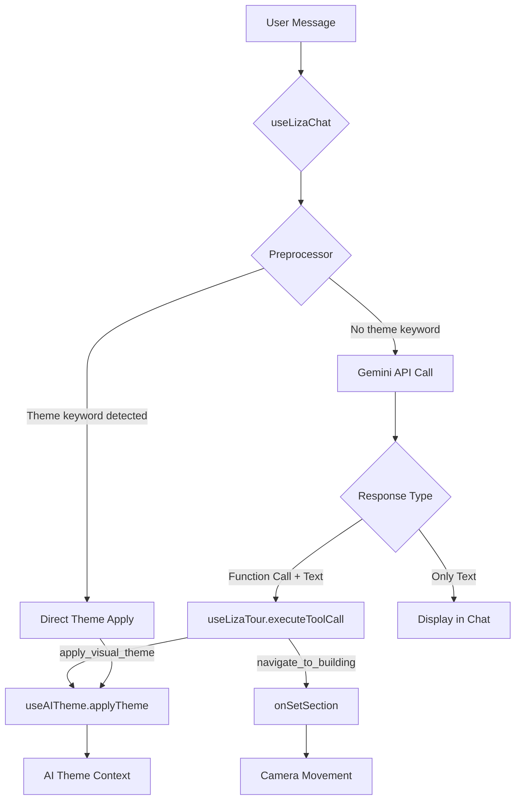

# LIZA Technical Analysis - Complete Architecture Review

**Date**: 2025-12-02  
**Purpose**: Root cause analysis and architecture documentation before implementation  
**Status**: Analysis Complete - Ready for Implementation Plan

---

## 📊 Current Architecture (What Works)

### Component Overview



### File Structure

**Configuration Files** (`/config/` and `/src/config/`):
- `keywords-map.json` - 10 keyword categories for smart context
- `theme-config.json` - 13 pre-established themes
- `theme-synonyms.json` - 70+ keyword→theme mappings
- `visual-states.json` - Material properties per theme per building

**LIZA Core Files** (`/src/utils/liza/` and `/src/hooks/liza/`):
- `liza-prompts.js` - System prompt + tool usage examples
- `liza-tools.js` - Tool definitions (navigate_to_building, apply_visual_theme)
- `liza-preprocessor.js` - Keyword detection for themes (skip API)
- `liza-smart-context.js` - Lazy loading based on keywords
- `useLizaChat.js` - Message handling + API calls
- `useLizaTour.js` - Tool execution (navigation + themes)
- `useAITheme.js` - Theme application logic

---

## 🚨 Problems Identified

### Problem 1: Theme Application Fails

**Symptom**: User says "change to chernobyl", theme doesn't apply

**Root Cause**: `useAITheme.applyTheme()` expects EITHER:
- Case A: `{ themeName: "chernobyl" }` → Load from theme-config.json
- Case B: `{ styleName, primaryColor, accentColor,... }` → Custom AI theme

BUT preprocessor returns: `{ themeName: "chernobyl" }`
AND function is async (dynamic import) causing timing issues

**Current Code**:
```javascript
// useAITheme.js línea 17
import('../../config/theme-config.json', { assert: { type: 'json' } })
  .then(({ default: themeConfig }) => {
    // Async - not awaited!
  });

return { success: true };  // Returns BEFORE theme applies
```

**Fix Needed**: Import at module level (synchronous)

---

### Problem 2: Navigation Doesn't Execute

**Symptom**: User says "navega a Experience", Gemini calls `navigate_to_building`, but camera doesn't move

**Root Cause**: 
1. API returns function call + text
2. `useLizaChat.js` línea 82 executes `onToolCall(fc)`
3. BUT línea 85-88 was DELETED - no longer adds confirmation message
4. Function executes but user doesn't see confirmation

**Missing Logging**: No visual feedback that navigation happened

**Current Code**:
```javascript
// useLizaChat.js línea 80-85
for (const fc of data.functionCalls) {
  console.log('[useLizaChat] Executing function:', fc.name);
  onToolCall(fc);  // Executes navigation
  // DON'T add system messages - tool execution should be visual/silent
}
```

**Issue**: Navigation IS executing, but:
- No chat confirmation
- Possible `onSetSection` not working correctly

---

### Problem 3: Code/JSON Showing in Chat

**Symptom**: Chat shows function call code instead of text

**Root Cause**: When Gemini returns function_call + text, we need to:
1. Execute function call silently
2. Show ONLY the text response

**Current Code** (línea 92-98):
```javascript
// If there's also a text response, add it
if (data.textResponse) {
  console.log('[useLizaChat] ✅ Also got text response:', data.textResponse);
  setMessages(prev => [...prev, {
    role: 'assistant',
    content: data.textResponse
  }]);
}
```

**Issue**: `data.textResponse` might not exist or be named differently

---

### Problem 4: Theme Reapplying on Every Message

**Symptom**: After applying a theme, it reapplies on subsequent messages

**Root Cause**: Preprocessor runs on EVERY message
- If previous message was "change to ocean"
- Next message "tell me about React"
- Preprocessor still detects "ocean" in history?

**Actual Cause**: Need to check logs to confirm

---

## 🔍 Component Deep Dive

### 1. Preprocessor (`liza-preprocessor.js`)

**Purpose**: Detect theme keywords and skip API call

**Current Logic**:
```javascript
1. Build keyword map from theme-config.json + theme-synonyms.json
2. Check if message contains ANY keyword
3. If YES → Return { type: 'apply_visual_theme', args: { themeName: "key" }, skipAPI: true }
4. If NO → Return null (call API)
```

**Correctness**: ✅ Logic is correct
**Issues**: 
- Returns `themeName` but useAITheme expects different structure
- Dynamic import at module level should be static

---

### 2. Theme Application (`useAITheme.js`)

**Purpose**: Apply theme to buildings

**Expected Input**:
- Case 1: `{ themeName: "chernobyl" }` → PreProcessingestablished theme
- Case 2: `{ styleNname, primaryColor, ... }` → Custom AI theme

**Current Logic**:
```javascript
if (themeData.themeName) {
  // Import theme-config.json dynamically (ASYNC!)
  import('../../config/theme-config.json').then(...)
  // Build fullThemeData from config
  // applyThemeToContext(fullThemeData)
} else {
  // Custom theme
  applyThemeToContext(themeData)
}
```

**Issues**:
- ❌ Async import causes race condition
- ❌ Returns success BEFORE theme actually applies
- ✅ Logic for both cases is correct

---

### 3. Navigation (`useLizaTour.executeToolCall`)

**Purpose**: Execute tool calls from Gemini

**Current Logic** (línea 12-46):
```javascript
case 'navigate_to_building': {
  const { building, mode = 'FOCUS' } = toolCall.args;
  
  if (onSetSection) {
    onSetSection(building, { skipCameraChange: true });
  }
  
  if (onSetCameraMode) {
    setTimeout(() => {
      onSetCameraMode(mode === 'INSIDE' ? STRINGS.INSIDE : STRINGS.FOCUS);
    }, 50);
  }
  
  return { success: true, message: `Navegando a ${building}...` };
}
```

**Correctness**: ✅ Logic looks correct
**Possible Issue**: 
- `onSetSection(building)` - is `building` the correct format? (e.g., "Experience" vs "experience")
- Need to verify building names match `buildings-config.json`

---

### 4. Message Flow (`useLizaChat.sendMessage`)

**Flow 1: Preprocessor Detects Theme**:
```
User: "change to ocean"
  ↓
preprocessMessage() → { type: 'apply_visual_theme', args: { themeName: "ocean" }, skipAPI: true }
  ↓
onToolCall({ name: 'apply_visual_theme', args: { themeName: "ocean" } })
  ↓
useLizaTour.executeToolCall() → applyTheme({ themeName: "ocean" })
  ↓
useAITheme.applyTheme() → ??? (async issue)
```

**Flow 2: API Call (Navigation)**:
```
User: "navega a Experience"
  ↓
preprocessMessage() → null (no theme keyword)
  ↓
API call to Gemini
  ↓
Gemini response: { functionCalls: [{ name: 'navigate_to_building', args: {...} }], textResponse: "..." }
  ↓
Execute function call (navigation)
  ↓
Show textResponse in chat
```

---

## 🎯 Root Causes Summary

| Problem | Root Cause | Fix |
|---------|-----------|-----|
| **Theme not applying** | useAITheme async import | Change to static import |
| **Navigation not working** | Unknown - need to debug | Check onSetSection args |
| **Code in chat** | textResponse not extracted correctly | Fix response parsing |
| **Theme reapplying** | Unknown - need logs | Investigate preprocessor |

---

## ✅ What's Working Correctly

1. ✅ **Preprocessor keyword detection** - Correctly identifies theme keywords
2. ✅ **Smart context** - Lazy loading based on keywords
3. ✅ **Gemini API integration** - Tool calling works
4. ✅ **Tool definitions** - liza-tools.js is correct
5. ✅ **System prompt** - liza-prompts.js has good instructions

---

## 📋 Files That Need Changes

### Must Change:
1. **`useAITheme.js`** - Fix async import issue
2. **`useLizaChat.js`** - Fix textResponse extraction
3. **`useLizaTour.js`** - Verify navigation args

### Might Change:
4. **`liza-preprocessor.js`** - Might need tweaks after testing

### Don't Change:
- ❌ `liza-prompts.js` - Working correctly
- ❌ `liza-tools.js` - Working correctly
- ❌ `liza-smart-context.js` - Working correctly
- ❌ `theme-config.json` - Data file
- ❌ `theme-synonyms.json` - Data file

---

## 🔬 Questions for Implementation Plan

1. **API Response Structure**: Need to see actual logs of what Gemini returns
   - Is it `data.textResponse` or `data.text` or `response.text()`?
   - How are function calls returned?

2. **Navigation Args**: Need to verify
   - Does `onSetSection("Experience")` work?
   - Or does it need `onSetSection("experience")` (lowercase)?
   - Check `buildings-config.json` for correct keys

3. **Theme Application Timing**: 
   - After fixing async, does theme apply correctly?
   - Is there visual confirmation?

---

## 📊 Verification Strategy

### Test 1: Theme Application (Preprocessor)
```
Input: "change to chernobyl"
Expected:
  - ✅ Preprocessor detects "chernobyl"
  - ✅ Skips API call
  - ✅ Calls useAITheme with { themeName: "chernobyl" }
  - ✅ Theme applies instantly
  - ✅ Chat shows confirmation
```

### Test 2: Navigation (API)
```
Input: "navega a Experience"
Expected:
  - ✅ Preprocessor passes to API (no theme keyword)
  - ✅ Gemini returns navigate_to_building + text
  - ✅ Navigation executes (camera moves)
  - ✅ Chat shows ONLY text response
```

### Test 3: Content Question (API)
```
Input: "cuéntame sobre React"
Expected:
  - ✅ Preprocessor passes to API
  - ✅ Gemini returns ONLY text (no function call)
  - ✅ Chat shows text response
```

---

**Next Step**: Create Implementation Plan with specific code changes
