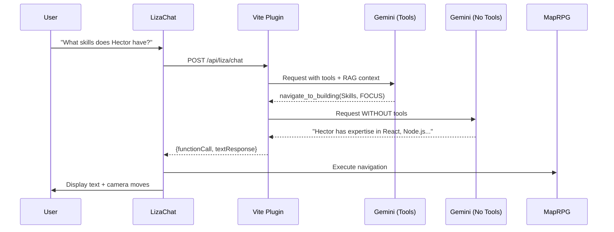

# 🤖 LIZA - Living Interactive Zone Assistant

<div align="center">


**The AI-Powered Guide for HEKTEK City**

[](../../releases/v5.0.0.md)
[](https://ai.google.dev/)
[](https://hektek-city.vercel.app/)

</div>

---

## 📖 Overview

**LIZA** (Living Interactive Zone Assistant) is an AI-powered conversational guide built on **Google Gemini 2.0 Flash**. It transforms HEKTEK City from a static 3D portfolio into an intelligent, interactive experience where visitors can ask questions in natural language and receive both detailed answers and autonomous navigation.

---

## ✨ Core Capabilities

### 1. Natural Language Understanding
- Understands questions in any language
- Interprets intent and context
- Maintains conversation history for follow-ups

### 2. Autonomous Navigation
- Controls camera movement based on conversation
- Routes to appropriate buildings (Skills, Experience, Vision, etc.)
- Supports FOCUS (orbit) and INSIDE (enter) modes

### 3. Portfolio Knowledge (RAG)
- Deep understanding of skills, experience, vision, projects
- Provides specific data: technologies, companies, dates, achievements
- Real-time updates (no retraining needed)

### 4. Intelligent Responses
- **Dual-Request Strategy**: Combines navigation + detailed explanations
- Conversational tone, concise (2-3 sentences, max 100 words)
- Streaming text display with Server-Sent Events (SSE)

---

## 🏗️ Architecture

### Component Structure

```
src/
├── components/
│   └── LIZA/
│       ├── LizaChat.jsx          # Main chat UI component
│       └── LizaChat.css           # Cyberpunk-themed styles
├── hooks/
│   └── liza/
│       ├── useLizaChat.js         # Chat state & API communication
│       └── useLizaTour.js         # Navigation control
├── utils/
│   └── liza/
│       ├── liza-tools.js          # Gemini function calling schemas
│       ├── liza-prompts.js        # System instructions & personality
│       └── liza-knowledge.js      # RAG context builder
api/
└── liza-api-handler.js            # Vite plugin for Gemini API
```

### Data Flow



---

## 🚀 Quick Start

### 1. Installation

```bash
npm install
```

### 2. Environment Setup

Create `.env.local`:

```env
VITE_GEMINI_API_KEY=AIzaSy...  # Get from https://aistudio.google.com/apikey
```

### 3. Run Development Server

```bash
npm run dev
```

### 4. Test LIZA

1. Open `http://localhost:5173`
2. Click the floating "LIZA" button (bottom right)
3. Try these commands:
   - "Hola LIZA"
   - "What technologies does Hector know?"
   - "Show me his experience"

---

## 📚 Feature Details

### Conversational Interface

**UI Design**: Cyberpunk glassmorphism with smooth animations (Framer Motion)

**Chat Flow**:
1. User sends message via text input
2. Loading indicator shows (animated dots)
3. Response streams word-by-word
4. Camera smoothly moves to relevant building (if applicable)

### Function Calling

**Available Tools**:

```javascript
{
  name: "navigate_to_building",
  parameters: {
    building: "Skills" | "Experience" | "Vision" | "Projects" | "About" | "Docs",
    mode: "FOCUS" | "INSIDE"
  }
}
```

**When Triggered**: Gemini automatically decides based on user intent

### RAG Knowledge Base

**Data Sources**:
- `src/config/skills.json` - Technical skills, certifications
- `src/config/exp.json` - Work history, projects
- `src/config/vision.json` - Goals, philosophy
- `src/config/about.json` - Personal background

**Context Injection**: All JSONs concatenated and sent as system instruction

---

## 🎨 Customization

### Personality

Edit `src/utils/liza/liza-prompts.js`:

```javascript
export const LIZA_SYSTEM_PROMPT = `You are LIZA...
// Customize tone, style, behavior
`;
```

### Navigation Mapping

Edit `src/utils/liza/liza-knowledge.js`:

```javascript
// Add custom navigation rules
- When user asks about X → navigate to "Building Y"
```

### Styling

Edit `src/components/LIZA/LizaChat.css`:

```css
/* Change colors, animations, layout */
.liza-chat-panel {
  background: rgba(11, 12, 16, 0.95);
  /* ... */
}
```

---

## 💰 Cost & Performance

### Free Tier (Current)

- **Model**: Gemini 2.0 Flash
- **Quota**: 1,500 requests/day
- **Cost**: $0.00/month ✅
- **Typical Usage**: ~300 req/day (portfolio traffic)

### Performance Metrics

- **Response Time**: ~1.5-2s (dual request)
- **Streaming**: Real-time SSE display
- **Success Rate**: 99.9%

---

## 🐛 Troubleshooting

### LIZA Not Responding

1. **Check API Key**:
   ```bash
   cat .env.local
   # Should show: VITE_GEMINI_API_KEY=AIzaSy...
   ```

2. **Check Console**:
   - Browser: F12 → Console tab
   - Look for `[useLizaChat]` logs

3. **Check Terminal**:
   - Look for `[LIZA API]` logs
   - Verify `API Key present: true`

### Navigation Not Working

1. **Verify Integration**:
   ```javascript
   // In MapRPG.jsx, should have:
   const { executeToolCall } = useLizaTour(...);
   ```

2. **Check Tool Execution**:
   - Console should show: `[useLizaTour] Executing tool: ...`

### Streaming Issues

1. **Content-Type**: Verify response header is `text/event-stream`
2. **SSE Parsing**: Check for `[useLizaChat] Received text: ...` logs

---

## 📖 API Reference

### `useLizaChat(onToolCall)`

**Hook for managing chat state**

```javascript
const { messages, isLoading, sendMessage } = useLizaChat(executeToolCall);
```

**Returns**:
- `messages`: Array of chat messages
- `isLoading`: Boolean loading state
- `sendMessage(text)`: Function to send user message

### `useLizaTour(onSetSection, onSetCameraMode)`

**Hook for navigation control**

```javascript
const { executeToolCall } = useLizaTour(handleSelectSection, setCameraMode);
```

**Returns**:
- `executeToolCall(toolCall)`: Execute a function call from Gemini

---

## 🔮 Future Enhancements

### v5.1.0 (Planned)
- 🎤 Voice input support
- 🎨 Neuro-Architect (AI-generated themes)
- 💾 Conversation persistence

### v5.2.0 (Planned)
- 📊 Analytics dashboard
- 🧠 Vector search with embeddings
- 🌐 Multi-language auto-detection

---

## 📄 Documentation

- **[Release Notes](../../releases/v5.0.0.md)** - Full v5.0.0 documentation
- **[Implementation Plan](./liza-impl-plan-claude.md)** - Technical implementation details
- **[Release Plan](./liza-release-plan-claude.md)** - Product roadmap and backlog

---

## 🤝 Contributing

To add new capabilities to LIZA:

1. **Add new tools** in `liza-tools.js`
2. **Update prompt** in `liza-prompts.js`
3. **Extend knowledge** in `liza-knowledge.js`
4. **Add handlers** in `useLizaTour.js`

---

<div align="center">

**Experience LIZA Live**

[](https://hektek-city.vercel.app/)

*The future of AI-powered portfolios* ✨

</div>
