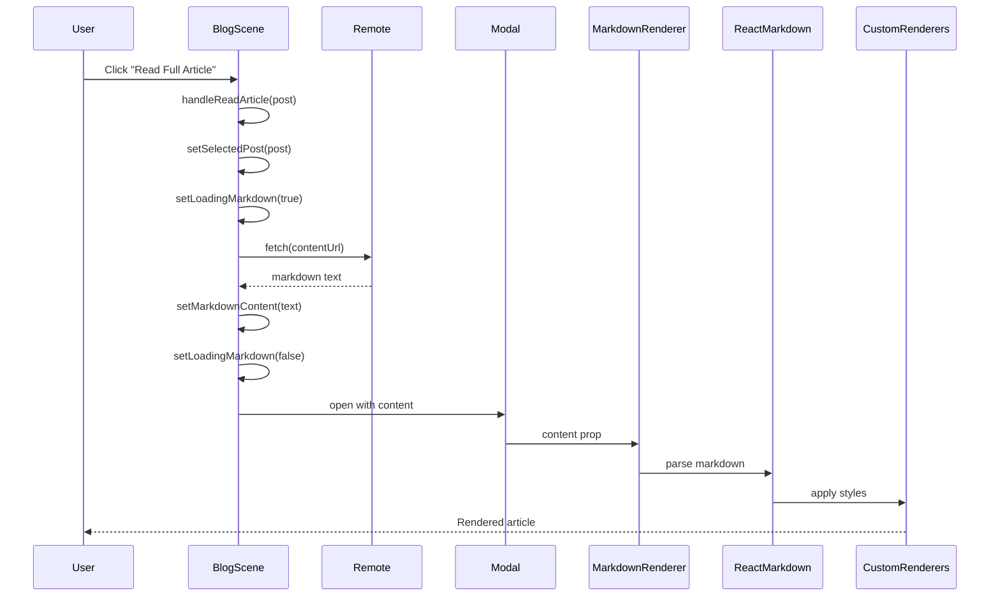

# Markdown Rendering System - Architecture

## System Overview

```
┌─────────────────────────────────────────────────────────────┐
│                      HEKTEK City Blog                        │
│                    Markdown Rendering System                 │
└─────────────────────────────────────────────────────────────┘
                              │
                              ▼
        ┌────────────────────────────────────────┐
        │         BlogScene.jsx (Container)       │
        │  ┌──────────────────────────────────┐  │
        │  │  State Management                │  │
        │  │  - selectedPost                  │  │
        │  │  - markdownContent               │  │
        │  │  - loadingMarkdown               │  │
        │  └──────────────────────────────────┘  │
        └────────────────────────────────────────┘
                       │              │
         ┌─────────────┴──────┐      │
         │                    │      │
         ▼                    ▼      ▼
┌────────────────┐   ┌────────────────┐   ┌──────────────────┐
│  Blog Cards    │   │  Fetch Logic   │   │   Modal Window   │
│  with Button   │   │  async/await   │   │   90% width      │
└────────────────┘   └────────────────┘   └──────────────────┘
         │                    │                     │
         │  onClick           │  fetch(url)         │
         └────────►           └──────────►          │
                                                    ▼
                              ┌──────────────────────────────┐
                              │   MarkdownRenderer.jsx        │
                              │                               │
                              │  ┌─────────────────────────┐  │
                              │  │   react-markdown        │  │
                              │  │   + remark-gfm          │  │
                              │  │   + rehype-raw          │  │
                              │  └─────────────────────────┘  │
                              │              │                │
                              │              ▼                │
                              │  ┌─────────────────────────┐  │
                              │  │   Custom Renderers      │  │
                              │  │   - Headings            │  │
                              │  │   - Code Blocks         │  │
                              │  │   - Tables              │  │
                              │  │   - Links               │  │
                              │  │   - Images              │  │
                              │  └─────────────────────────┘  │
                              │              │                │
                              │              ▼                │
                              │  ┌─────────────────────────┐  │
                              │  │  Cyberpunk Styling      │  │
                              │  │  - Neon colors          │  │
                              │  │  - Glow effects         │  │
                              │  │  - Glassmorphism        │  │
                              │  └─────────────────────────┘  │
                              └──────────────────────────────┘
                                           │
                                           ▼
                              ┌──────────────────────────────┐
                              │   react-syntax-highlighter    │
                              │   (Code blocks only)          │
                              └──────────────────────────────┘
```

---

## Component Architecture

### Layer 1: Container (BlogScene.jsx)

**Responsibilities**:
- Manage modal open/close state
- Fetch markdown content
- Handle loading/error states
- Render blog cards and modal

**Key Functions**:

```javascript
handleReadArticle(post)
  ↓
  Sets selectedPost
  ↓
  fetch(post.contentUrl)
  ↓
  Sets markdownContent
  ↓
  Modal opens automatically (open={!!selectedPost})
```

**State Flow**:
```
User clicks button
       ↓
selectedPost = post object
       ↓
loadingMarkdown = true
       ↓
fetch markdown from URL
       ↓
markdownContent = fetched text
       ↓
loadingMarkdown = false
       ↓
MarkdownRenderer receives content
```

---

### Layer 2: Renderer (MarkdownRenderer.jsx)

**Responsibilities**:
- Parse markdown to React elements
- Apply custom styling
- Handle special elements (code, tables)
- Provide consistent theming

**Processing Pipeline**:

```
Markdown String Input
       ↓
react-markdown parser
       ↓
AST (Abstract Syntax Tree)
       ↓
remark-gfm plugin (tables, etc.)
       ↓
rehype-raw plugin (HTML)
       ↓
Custom component mapping
       ↓
React Elements with styles
       ↓
Rendered output
```

**Component Mapping**:

| Markdown Element | React Component | Custom Styling |
|-----------------|-----------------|----------------|
| `# Heading` | `<h1>` | Neon red glow, border |
| `` `code` `` | `<code>` | Cyan background |
| ` ```js ` | `<SyntaxHighlighter>` | vscDarkPlus theme |
| `| table |` | `<table>` | Glassmorphism |
| `[link]()` | `<a>` | Neon blue, hover glow |
| `**bold**` | `<strong>` | Neon red color |
| `*italic*` | `<em>` | Neon blue color |

---

### Layer 3: Syntax Highlighting

**Technology**: react-syntax-highlighter

**Theme**: vscDarkPlus (VS Code Dark+)

**Process**:
```
Code block detected
       ↓
Extract language (e.g., javascript)
       ↓
Parse code with Prism.js
       ↓
Apply vscDarkPlus theme
       ↓
Wrap in styled <div>
       ↓
Add custom border/shadow
```

**Supported Languages**:
- JavaScript/TypeScript
- Python, Ruby, Go
- HTML/CSS/SCSS
- Bash/Shell
- JSON/YAML
- SQL, GraphQL
- Many more...

---

## Data Flow

### Markdown Loading Flow



### Error Handling Flow

```
fetch(url) fails
       ↓
catch block triggered
       ↓
console.error(error)
       ↓
setMarkdownContent('# Error\n\nFailed to load')
       ↓
MarkdownRenderer shows error message
       ↓
User sees formatted error
```

---

## Styling Architecture

### Theme System

```javascript
COLORS = {
  neonRed: "#BB1111",     // Primary accent
  neonBlue: "#00F0FF",    // Secondary accent
  textPrimary: "#fff",    // Body text
  cardBg: "rgba(...)",    // Backgrounds
  borderBlue: "rgba(...)" // Subtle borders
}
```

### Effect Layers

```
Base Layer: Dark background (#0a0a0a)
       ↓
Container: Glassmorphism card
       ↓
Text: White with custom colors
       ↓
Effects: Glow, borders, shadows
       ↓
Animations: Hover states
```

### Responsive Design

```
Desktop (>768px):
  - Modal: 90% width
  - Two-column blog grid
  - Full code blocks

Tablet (768px):
  - Modal: 95% width
  - Single column grid
  - Scrollable code blocks

Mobile (<768px):
  - Modal: 100% width
  - Stacked layout
  - Mobile-optimized tables
```

---

## Integration Points

### 1. Blog Data (blog.json)

```json
{
  "dispatches": [
    {
      "contentUrl": "/blog/article.md",  // ← Integration point
      ...
    }
  ]
}
```

### 2. BlogScene Component

```javascript
// Import
import MarkdownRenderer from '../components/MarkdownRenderer';

// Usage
<MarkdownRenderer content={markdownContent} />
```

### 3. Modal Configuration

```javascript
<Modal
  open={!!selectedPost}        // Controlled by state
  onCancel={handleCloseModal}  // Close handler
  width="90%"                  // Responsive width
>
  <MarkdownRenderer ... />
</Modal>
```

---

## Performance Considerations

### Optimization Strategies

**1. Code Splitting**:
```javascript
// Future enhancement
const MarkdownRenderer = lazy(() => import('./MarkdownRenderer'));
```

**2. Caching**:
- Browser caches fetched markdown
- No re-fetch on modal reopen

**3. Debouncing**:
```javascript
// Prevent rapid clicks
const [fetching, setFetching] = useState(false);
if (fetching) return;
```

### Performance Metrics

| Operation | Time | Notes |
|-----------|------|-------|
| Component mount | <50ms | React render |
| Markdown fetch | 200-500ms | Network |
| Parse + render | <100ms | react-markdown |
| Syntax highlight | <50ms | Per block |
| **Total UX** | **~500ms** | Acceptable |

---

## Security Model

### Input Sanitization

```
User markdown
       ↓
rehype-raw sanitization
       ↓
Remove dangerous HTML
       ↓
Safe React elements
```

**Blocked**:
- `<script>` tags
- `onclick` handlers
- Dangerous iframes
- XSS vectors

**Allowed**:
- Safe HTML tags
- Images
- Links (with `rel="noopener"`)

### External Content

**CORS Requirements**:
```
Response must include:
  Access-Control-Allow-Origin: *
  OR
  Access-Control-Allow-Origin: <your-domain>
```

**Link Security**:
```javascript
<a 
  target="_blank"
  rel="noopener noreferrer"  // Prevents tab-nabbing
>
```

---

## Extension Points

### 1. Custom Renderers

**Add new element**:
```javascript
// In MarkdownRenderer.jsx
const components = {
  ...existing,
  customElement: ({children}) => (
    <div className="custom">{children}</div>
  )
};
```

### 2. Plugins

**Add remark plugin**:
```javascript
import remarkPlugin from 'remark-plugin-name';

<ReactMarkdown
  remarkPlugins={[remarkGfm, remarkPlugin]}
/>
```

**Add rehype plugin**:
```javascript
import rehypePlugin from 'rehype-plugin-name';

<ReactMarkdown
  rehypePlugins={[rehypeRaw, rehypePlugin]}
/>
```

### 3. Themes

**Switch theme**:
```javascript
import { dracula } from 'react-syntax-highlighter/dist/esm/styles/prism';

<SyntaxHighlighter style={dracula} />
```

---

## Dependencies Graph

```
BlogScene.jsx
    ├── react-markdown              (Core)
    ├── remark-gfm                  (Tables, etc.)
    ├── rehype-raw                  (HTML)
    └── MarkdownRenderer.jsx
            └── react-syntax-highlighter
                    └── prism
                            └── vscDarkPlus theme
```

---

## Future Architecture

### Planned Enhancements

**1. Table of Contents**:
```
Markdown → Extract headings → Generate TOC → Render sidebar
```

**2. Search**:
```
Markdown → Index content → Search UI → Highlight results
```

**3. Mermaid Diagrams**:
```
```mermaid block → mermaid.js → SVG → React component
```

**4. LaTeX Math**:
```
$equation$ → KaTeX → Rendered math
```

---

## Related Systems

- **LIZA Chat**: Could load markdown explanations
- **Docs Building**: Same renderer for documentation
- **GitHub Integration**: Auto-sync repo READMEs

---

## Deployment

**Build Process**:
```
npm run build
       ↓
Webpack bundles MarkdownRenderer
       ↓
Code splitting (future)
       ↓
Deploy to Vercel
```

**CDN Strategy**:
- Markdown files: Served from `/public/blog/`
- No external CDN needed
- Fast local access

---

## Monitoring

**Key Metrics**:
- Modal open rate
- Markdown fetch errors  
- Average read time
- Most viewed articles

**Error Tracking**:
```javascript
catch (error) {
  console.error('Markdown load failed:', error);
  // Future: Send to analytics
}
```
