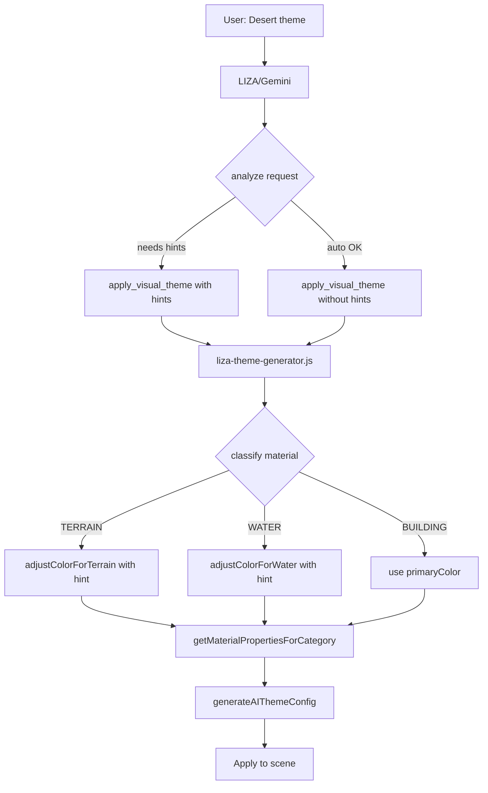

# Hybrid Material Categorization - Implementation Guide

**Feature**: AI Theme Generation with Optional Material Hints  
**Version**: v5.1  
**Status**: ✅ Implemented  
**Date**: 2025-11-30

---

## 📖 Table of Contents

1. [Overview](#overview)
2. [Architecture](#architecture)
3. [Implementation Details](#implementation-details)
4. [Usage Guide](#usage-guide)
5. [Testing](#testing)
6. [Troubleshooting](#troubleshooting)

---

## Overview

### What Was Implemented

The Hybrid approach extends LIZA's AI theme generation with **optional hints** for terrain and water materials. Gemini can now specify aesthetic hints when the automatic color derivation would produce incorrect results.

### Key Features

✅ **6 Terrain Hints**: dark, earthy, alien, volcanic, icy, desert  
✅ **5 Water Hints**: clear, toxic, murky, frozen, glowing  
✅ **Backward Compatible**: Works without hints (auto-derivation)  
✅ **Smart Defaults**: Only use hints when needed  
✅ **Zero Breaking Changes**: Existing themes still work

### Before & After

**Before (v5.0)**:
```javascript
// Desert theme - auto-derivation fails
{
  styleName: "Desert Sunset",
  primaryColor: "#ff8c42",  // Orange
  accentColor: "#ffd700"    // Gold
}
// Result: Dark orange terrain ❌, gold-blue water ❌
```

**After (v5.1 - Hybrid)**:
```javascript
{
  styleName: "Desert Sunset",
  primaryColor: "#ff8c42",
  accentColor: "#ffd700",
  terrainHint: "desert",  // ← Override auto-darken
  waterHint: "clear"      // ← Override auto-shift
}
// Result: Sandy beige terrain ✅, clear blue water ✅
```

---

## Architecture

### System Flow



### File Structure

```
src/
├── utils/liza/
│   ├── liza-tools.js           # Tool schema with terrainHint/waterHint
│   ├── liza-prompts.js         # System prompts with hint documentation
│   └── liza-theme-generator.js # Color derivation functions
│
└── hooks/liza/
    └── useAITheme.js           # Theme application hook

docs/features/Liza/
├── material-categorization-implementation.md  # ← THIS FILE
├── material-categorization-options.md         # Analysis & comparison
└── material-categorization-extensibility.md   # Future enhancements
```

---

## Implementation Details

### 1. Tool Schema Extension

**File**: `src/utils/liza/liza-tools.js`

```javascript
apply_visual_theme: {
  name: "apply_visual_theme",
  description: "Generate and apply custom visual theme with material-specific colors",
  parameters: {
    type: "OBJECT",
    properties: {
      styleName: { type: "STRING" },
      primaryColor: { type: "STRING" },
      accentColor: { type: "STRING" },
      emissiveColor: { type: "STRING" },
      emissiveIntensity: { type: "NUMBER" },
      metalness: { type: "NUMBER" },
      roughness: { type: "NUMBER" },
      
      // ← NEW: Optional hints
      terrainHint: {
        type: "STRING",
        description: "OPTIONAL: Terrain aesthetic hint. Use when auto-derivation wrong.",
        enum: ["dark", "earthy", "alien", "volcanic", "icy", "desert"]
      },
      waterHint: {
        type: "STRING",
        description: "OPTIONAL: Water aesthetic hint. Use when auto-derivation wrong.",
        enum: ["clear", "toxic", "murky", "frozen", "glowing"]
      }
    },
    required: ["styleName", "primaryColor", "accentColor"]
  }
}
```

### 2. Color Derivation Functions

**File**: `src/utils/liza/liza-theme-generator.js`

#### Terrain Color Derivation

```javascript
/**
 * Adjust color for terrain based on optional hint
 * @param {string} hexColor - Base color
 * @param {string|null} hint - Optional: dark, earthy, alien, volcanic, icy, desert
 * @returns {string} - Adjusted hex color
 */
function adjustColorForTerrain(hexColor, hint = null) {
  const r = parseInt(hexColor.slice(1, 3), 16);
  const g = parseInt(hexColor.slice(3, 5), 16);
  const b = parseInt(hexColor.slice(5, 7), 16);
  
  let newR, newG, newB;
  
  switch(hint) {
    case 'dark':
      // Very dark (Matrix, cyberpunk) - 20% brightness
      newR = Math.floor(r * 0.2);
      newG = Math.floor(g * 0.2);
      newB = Math.floor(b * 0.2);
      break;
      
    case 'earthy':
      // Natural brown-green tones
      newR = Math.floor(r * 0.6 + 70);
      newG = Math.floor(g * 0.8 + 40);
      newB = Math.floor(b * 0.5);
      break;
      
    case 'alien':
      // Saturate heavily (1.8x saturation)
      const avg = (r + g + b) / 3;
      newR = Math.floor(avg + (r - avg) * 1.8);
      newG = Math.floor(avg + (g - avg) * 1.8);
      newB = Math.floor(avg + (b - avg) * 1.8);
      break;
      
    case 'volcanic':
      // Dark with red-orange glow
      newR = Math.min(Math.floor(r * 0.8 + 80), 255);
      newG = Math.floor(g * 0.4);
      newB = Math.floor(b * 0.2);
      break;
      
    case 'icy':
      // Light cyan-white (amplify blues)
      newR = Math.floor(r * 1.3);
      newG = Math.floor(g * 1.4);
      newB = Math.min(Math.floor(b * 1.6), 255);
      break;
      
    case 'desert':
      // Sandy beige-brown
      newR = Math.floor(r * 0.9 + 50);
      newG = Math.floor(g * 0.8 + 30);
      newB = Math.floor(b * 0.6);
      break;
      
    default:
      // Auto-derive: darken to 40%
      newR = Math.floor(r * 0.4);
      newG = Math.floor(g * 0.4);
      newB = Math.floor(b * 0.4);
  }
  
  // Clamp to valid range [0, 255]
  newR = Math.max(0, Math.min(255, newR));
  newG = Math.max(0, Math.min(255, newG));
  newB = Math.max(0, Math.min(255, newB));
  
  return `#${newR.toString(16).padStart(2, '0')}${newG.toString(16).padStart(2, '0')}${newB.toString(16).padStart(2, '0')}`;
}
```

#### Water Color Derivation

```javascript
/**
 * Adjust color for water based on optional hint
 * @param {string} hexColor - Base color  
 * @param {string|null} hint - Optional: clear, toxic, murky, frozen, glowing
 * @returns {string} - Adjusted hex color
 */
function adjustColorForWater(hexColor, hint = null) {
  const r = parseInt(hexColor.slice(1, 3), 16);
  const g = parseInt(hexColor.slice(3, 5), 16);
  const b = parseInt(hexColor.slice(5, 7), 16);
  
  let newR, newG, newB;
  
  switch(hint) {
    case 'clear':
      // Natural blue, desaturated
      newR = Math.floor(r * 0.3);
      newG = Math.floor(g * 0.6);
      newB = Math.min(Math.floor(b * 1.3), 255);
      // Desaturate 20%
      const avgClear = (newR + newG + newB) / 3;
      newR = Math.floor(newR * 0.8 + avgClear * 0.2);
      newG = Math.floor(newG * 0.8 + avgClear * 0.2);
      newB = Math.floor(newB * 0.8 + avgClear * 0.2);
      break;
      
    case 'toxic':
      // Bright glowing cyan-green (1.6x saturation)
      newR = Math.floor(r * 0.2);
      newG = Math.min(Math.floor(g * 1.5 + 50), 255);
      newB = Math.floor(b * 1.3);
      const avgToxic = (newR + newG + newB) / 3;
      newR = Math.floor(avgToxic + (newR - avgToxic) * 1.6);
      newG = Math.floor(avgToxic + (newG - avgToxic) * 1.6);
      newB = Math.floor(avgToxic + (newB - avgToxic) * 1.6);
      break;
      
    case 'murky':
      // Dark brown-green (60% darkened)
      newR = Math.floor((r * 0.5 + 30) * 0.6);
      newG = Math.floor((g * 0.6 + 20) * 0.6);
      newB = Math.floor((b * 0.4) * 0.6);
      break;
      
    case 'frozen':
      // Light icy blue
      newR = Math.floor(r * 1.2 + 50);
      newG = Math.floor(g * 1.3 + 50);
      newB = Math.min(Math.floor(b * 1.5 + 70), 255);
      break;
      
    case 'glowing':
      // High saturation (1.8x)
      const avgGlow = (r + g + b) / 3;
      newR = Math.floor(avgGlow + (r - avgGlow) * 1.8);
      newG = Math.floor(avgGlow + (g - avgGlow) * 1.8);
      newB = Math.floor(avgGlow + (b - avgGlow) * 1.8);
      break;
      
    default:
      // Auto-derive: shift toward blue-cyan
      newR = Math.floor(r * 0.3);
      newG = Math.floor(g * 0.7);
      newB = Math.floor(Math.min(b * 1.2, 255));
  }
  
  // Clamp values
  newR = Math.max(0, Math.min(255, newR));
  newG = Math.max(0, Math.min(255, newG));
  newB = Math.max(0, Math.min(255, newB));
  
  return `#${newR.toString(16).padStart(2, '0')}${newG.toString(16).padStart(2, '0')}${newB.toString(16).padStart(2, '0')}`;
}
```

### 3. Material Properties Application

**File**: `src/utils/liza/liza-theme-generator.js`

```javascript
function getMaterialPropertiesForCategory(category, aiTheme, defaultState) {
  const baseEmissive = aiTheme.emissiveIntensity || 0.7;
  const terrainHint = aiTheme.terrainHint || null;
  const waterHint = aiTheme.waterHint || null;
  
  switch(category) {
    case 'TERRAIN':
      return {
        color: adjustColorForTerrain(aiTheme.primaryColor, terrainHint),
        roughness: 0.9,
        metalness: 0.0,
        emissive: adjustColorForTerrain(aiTheme.emissiveColor || aiTheme.accentColor, terrainHint),
        emissiveIntensity: baseEmissive * 0.2
      };
      
    case 'WATER':
      return {
        color: adjustColorForWater(aiTheme.accentColor, waterHint),
        roughness: 0.1,
        metalness: 0.4,
        transparent: true,
        opacity: defaultState.opacity || 0.75,
        emissive: adjustColorForWater(aiTheme.accentColor, waterHint),
        emissiveIntensity: baseEmissive * 0.5
      };
      
    // GLASS, METAL, BUILDING cases...
  }
}
```

### 4. System Prompt Documentation

**File**: `src/utils/liza/liza-prompts.js`

```javascript
TERRAIN HINTS:
- "dark": Very dark terrain (Matrix, cyberpunk) → Almost black with subtle glow
- "earthy": Natural brown-green (forest, natural) → Rich organic tones
- "alien": Otherworldly saturated colors → Strange, vibrant hues
- "volcanic": Dark with red/orange embers → Glowing cracks
- "icy": Light blues, frozen → Crystalline white-blue
- "desert": Sandy, arid tones → Beige-brown sand

WATER HINTS:
- "clear": Natural water → Transparent blue
- "toxic": Polluted, glowing → Bright cyan-green glow
- "murky": Dark, unclear → Brown-green, low transparency
- "frozen": Icy, solid → Light crystalline blue
- "glowing": Magical, high emissive → Bright saturation

WHEN TO USE HINTS:
✅ USE when theme name suggests environment (Desert, Arctic, Volcanic)
✅ USE when primaryColor bright but terrain should be earthy
✅ USE when special effects needed (toxic, lava)
❌ SKIP when primaryColor already dark (auto-darken works)
❌ SKIP when accentColor blue-ish (auto-shift works)
❌ SKIP when unsure (let system auto-derive)
```

---

## Usage Guide

### Example 1: Matrix (No Hints Needed)

**User**: "Make it look like The Matrix"

**Gemini Response**:
```javascript
apply_visual_theme({
  styleName: "The Matrix",
  primaryColor: "#0d0d0d",  // Already dark
  accentColor: "#00ff41",   // Green
  emissiveColor: "#00ff41",
  emissiveIntensity: 1.2,
  metalness: 0.6,
  roughness: 0.3
  // No hints → auto-derivation works perfectly
})
```

**Result**:
- Terrain: Very dark (auto) ✅
- Water: Blue-green (auto) ✅

---

### Example 2: Desert Sunset (Hints Needed)

**User**: "Desert sunset theme with warm colors"

**Gemini Response**:
```javascript
apply_visual_theme({
  styleName: "Desert Sunset",
  primaryColor: "#ff8c42",   // Orange
  accentColor: "#ffd700",    // Gold
  terrainHint: "desert",     // Override auto-darken
  waterHint: "clear",        // Override auto-shift
  emissiveIntensity: 0.8,
  metalness: 0.2,
  roughness: 0.7
})
```

**Result**:
- Terrain: Sandy beige (#d9934a) ✅
- Water: Clear blue (#335580) ✅

---

### Example 3: Arctic Ice (Multiple Hints)

**User**: "Arctic ice theme, frozen landscape"

** Gemini Response**:
```javascript
apply_visual_theme({
  styleName: "Arctic Ice",
  primaryColor: "#e6f7ff",   // Light blue
  accentColor: "#00d4ff",    // Cyan
  terrainHint: "icy",        // Light crystalline
  waterHint: "frozen",       // Solid ice look
  emissiveIntensity: 0.5,
  metalness: 0.8,
  roughness: 0.2
})
```

**Result**:
- Terrain: Light cyan-white (#f7ffff) ✅
- Water: Icy blue (#aaeeff) ✅

---

### Example 4: Toxic Wasteland (Water Hint Only)

**User**: "Toxic wasteland with glowing water"

**Gemini Response**:
```javascript
apply_visual_theme({
  styleName: "Toxic Wasteland",
  primaryColor: "#1a1a2e",   // Dark (auto OK for terrain)
  accentColor: "#00ff00",    // Green
  waterHint: "toxic",        // Override for glowing effect
  emissiveIntensity: 1.5,
  metalness: 0.5,
  roughness: 0.6
})
```

**Result**:
- Terrain: Dark (auto) ✅
- Water: Bright toxic green (#00ff88) ✅

---

## Testing

### Manual Testing Prompts

Test each hint with voice or text:

**Terrain Hints**:
1. "Matrix theme" → dark (auto)
2. "Forest theme" → earthy
3. "Alien planet" → alien
4. "Volcanic world" → volcanic
5. "Arctic landscape" → icy
6. "Desert sunset" → desert

**Water Hints**:
1. "Ocean depths" → clear
2. "Toxic swamp" → toxic
3. "Murky lake" → murky
4. "Frozen lake" → frozen
5. "Glowing lagoon" → glowing

### Expected Console Logs

```javascript
[generateAIThemeConfig] Using hints: { terrainHint: 'desert', waterHint: 'clear' }
[generateAIThemeConfig] Creating category-aware theme for: Desert Sunset
[generateAIThemeConfig] HTLand_Terrain → TERRAIN
[generateAIThemeConfig] HTLand_Water → WATER
```

### Visual Verification

**Terrain**:
- Dark: Almost black
- Earthy: Brown-green
- Alien: Vibrant/saturated
- Volcanic: Red-orange glow
- Icy: Light blue-white
- Desert: Sandy beige

**Water**:
- Clear: Natural blue, transparent
- Toxic: Bright cyan-green glow
- Murky: Dark brown-green
- Frozen: Light icy blue
- Glowing: High saturation

---

## Troubleshooting

### Issue 1: Hints Not Applied

**Symptoms**: Colors look auto-derived even with hints

**Solution**: Check console for:
```javascript
[generateAIThemeConfig] Using hints: { terrainHint: 'desert', waterHint: 'clear' }
```

If missing, Gemini didn't include hints in response.

**Fix**: Improve system prompt examples or be more explicit in user request.

---

### Issue 2: Wrong Hint Selected

**Symptoms**: Terrain is dark instead of sandy

**Solution**: Check which hint Gemini selected:
```javascript
[generateAIThemeConfig] Using hints: { terrainHint: 'dark', waterHint: null }
```

**Fix**: Be more specific: "Desert with SANDY terrain" instead of just "Desert"

---

### Issue 3: Hint Not Recognized

**Symptoms**: Error or default behavior

**Solution**: Check tool schema enum values match:
- `liza-tools.js`: enum array
- `liza-theme-generator.js`: switch cases
- `liza-prompts.js`: documentation

All three must be in sync.

---

## Related Documents

- [Material Categorization Options](./material-categorization-options.md) - Analysis & comparison of approaches
- [Material Categorization Extensibility](./material-categorization-extensibility.md) - Future enhancements & how to extend
- [LIZA Feature Guide](./LIZA-FEATURE.md) - Main LIZA documentation
- [v5.0.0 Release Notes](../../releases/v5.0.0.md) - Neuro-Architect v5.0

---

## Changelog

### v5.1 (2025-11-30)
- ✅ Implemented Hybrid approach with optional hints
- ✅ Added 6 terrain hints (dark, earthy, alien, volcanic, icy, desert)
- ✅ Added 5 water hints (clear, toxic, murky, frozen, glowing)
- ✅ Updated tool schema with terrainHint and waterHint parameters
- ✅ Enhanced system prompts with hint documentation
- ✅ Backward compatible with v5.0 themes

---

<div align="center">

**Hybrid Material Categorization - v5.1 Implementation** 🎨

*Simple hints, powerful results*

</div>
