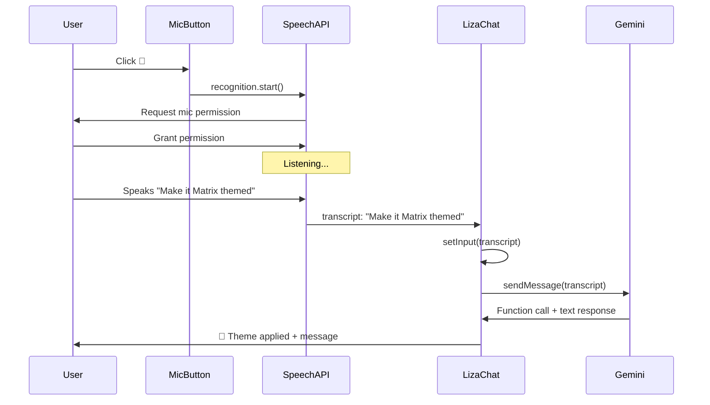

# 🎤 Speech Recognition for LIZA - Technical Analysis

**Feature**: Voice input for conversational AI interactions  
**Complexity**: ⭐⭐☆☆☆ (2/5 - Low-Medium)  
**Estimated Effort**: 4-6 hours  
**Dependencies**: Web Speech API (native browser API)

---

## 📊 Executive Summary

Implement voice input for LIZA using the **Web Speech API**, allowing users to speak naturally instead of typing. This enhances accessibility and creates a more conversational experience aligned with LIZA's AI-powered nature.

**Key Benefits**:
- ♿ Improved accessibility
- 🚀 Faster interaction (speaking is faster than typing)
- 🎯 More natural AI conversations
- 📱 Better mobile UX (no keyboard required)
- 🆓 Zero cost (native API, no cloud services)

---

## 🔍 Technology Analysis

### Web Speech API

The **SpeechRecognition API** is a native browser API that provides speech-to-text conversion.

**Browser Support**:
| Browser | Support | Notes |
|---------|---------|-------|
| Chrome/Edge | ✅ Full | `webkitSpeechRecognition` |
| Safari Desktop | ✅ Full | Since v14.1 |
| Safari iOS | ✅ Full | Since iOS 14.5 |
| Firefox | ⚠️ Partial | Requires flag in about:config |
| Opera | ✅ Full | Chromium-based |

**Coverage**: ~92% of global users (Chrome + Safari + Edge)

### API Characteristics

```javascript
const SpeechRecognition = window.SpeechRecognition || window.webkitSpeechRecognition;
const recognition = new SpeechRecognition();

// Configuration
recognition.continuous = false;      // Stop after one result
recognition.interimResults = false;  // Only final results
recognition.lang = 'es-MX';          // Language (auto-detect possible)
recognition.maxAlternatives = 1;     // Single best result

// Events
recognition.onresult = (event) => { /* transcript available */ };
recognition.onerror = (event) => { /* handle errors */ };
recognition.onend = () => { /* recognition ended */ };
```

**Advantages**:
- ✅ Free (no API costs)
- ✅ Fast (~1s latency)
- ✅ Works offline (after first use)
- ✅ Privacy-friendly (browser-only, no external services)
- ✅ Multi-language support (50+ languages)

**Limitations**:
- ⚠️ Requires user permission (microphone access)
- ⚠️ Must be triggered by user gesture (security)
- ⚠️ Spotty Firefox support
- ⚠️ No Safari iOS 13 support (requires iOS 14.5+)

---

## 🎯 Use Cases

### Primary Flow
```
User clicks microphone button
  ↓
Browser requests mic permission (first time only)
  ↓
LIZA starts listening (visual indicator)
  ↓
User speaks: "Show me your projects"
  ↓
Speech → Text conversion (~1s)
  ↓
Auto-fill input field
  ↓
Auto-send to LIZA (or manual confirmation)
  ↓
LIZA processes and responds
```

### User Stories

**Story 1: Mobile User**
> "As a mobile user, I want to speak to LIZA instead of typing on a small keyboard, so I can interact more naturally and quickly."

**Story 2: Accessibility**
> "As a user with motor disabilities, I want voice input as an alternative to typing, so I can access portfolio content independently."

**Story 3: Multitasking**
> "As a user exploring the 3D city, I want to ask LIZA questions without interrupting my view, so I can navigate and chat simultaneously."

---

## 🏗️ Architecture

### Component Structure

```
LizaChat (existing)
    ├── ChatInput (existing)
    │   ├── <textarea> (existing)
    │   └── 🆕 <MicrophoneButton>
    │
    └── 🆕 useSpeechRecognition (new hook)
        ├── startListening()
        ├── stopListening()
        ├── transcript state
        ├── isListening state
        └── error handling
```

### Data Flow



---

## 🎨 UI/UX Design

### Visual States

**1. Idle (Not Listening)**
```
┌────────────────────────────────┐
│  [Type message...]      [🎤]   │
└────────────────────────────────┘
```

**2. Listening (Active)**
```
┌────────────────────────────────┐
│  [Listening...]      [🔴 STOP] │
│  ● ● ● (pulsing animation)      │
└────────────────────────────────┘
```

**3. Processing (Received Speech)**
```
┌────────────────────────────────┐
│  "Make it Matrix themed"  [✓]  │
└────────────────────────────────┘
```

### Button Design

**Idle State**:
- Icon: 🎤 Microphone
- Color: #00F0FF (LIZA cyan)
- Tooltip: "Voice input"

**Active State**:
- Icon: ⏹️ Stop
- Color: #BB1111 (red)
- Pulsing animation
- Waveform visualization (optional)

**Error State**:
- Icon: 🎤 with ⚠️
- Color: #faad14 (warning)
- Tooltip: error message

---

## 🛠️ Technical Implementation

### New Files

**1. `src/hooks/liza/useSpeechRecognition.js`**
```javascript
export function useSpeechRecognition({
  onTranscript,
  onError,
  language = 'es-MX',
  continuous = false
}) {
  const [isListening, setIsListening] = useState(false);
  const [isSupported, setIsSupported] = useState(true);
  const recognitionRef = useRef(null);

  // Initialize SpeechRecognition
  // Handle start/stop/error events
  // Return { startListening, stopListening, isListening, isSupported }
}
```

**2. `src/components/LIZA/VoiceButton.jsx`**
```javascript
export default function VoiceButton({
  onTranscript,
  isListening,
  onStart,
  onStop
}) {
  // Render mic button with states
  // Handle click to toggle listening
  // Show visual feedback (pulsing, color)
}
```

### Modified Files

**`src/components/LIZA/LizaChat.jsx`**
- Import `useSpeechRecognition`
- Import `VoiceButton`
- Add voice button next to send button
- Handle transcript from hook
- Auto-fill input OR auto-send (configurable)

**`src/components/LIZA/LizaChat.css`**
- Styles for voice button
- Pulsing animation
- Active/error states

---

## 🔐 Security & Privacy

### Permissions

**Microphone Access**:
- Requires user consent (browser prompt)
- Only activates when button clicked
- No background listening
- Clear visual indicators when active

**Data Privacy**:
- Speech processing happens in-browser (Chrome/Safari)
- No audio sent to external servers (except browser's internal API)
- Transcript stays in client-side memory
- No logging or storage of voice data

### Best Practices

1. **Explicit User Action**: Only start listening on button click
2. **Clear Indicators**: Show when mic is active
3. **Easy Stop**: One-click to stop listening
4. **Fallback**: Typing always available as alternative
5. **Error Handling**: Graceful degradation if API unavailable

---

## 🌐 Language Support

### Multi-Language Detection

**Option A: Auto-Detect** (Recommended)
```javascript
// Use browser language
const browserLang = navigator.language; // 'es-MX', 'en-US', etc.
recognition.lang = browserLang;
```

**Option B: User Selection**
```javascript
// Language selector in settings
const [language, setLanguage] = useState('es-MX');
recognition.lang = language;
```

**Supported Languages** (50+):
- Spanish: es-ES, es-MX, es-AR, etc.
- English: en-US, en-GB, en-AU, etc.
- Portuguese: pt-BR, pt-PT
- French: fr-FR, fr-CA
- German: de-DE
- Italian: it-IT
- Japanese: ja-JP
- Chinese: zh-CN, zh-TW
- And many more...

---

## ⚡ Performance Considerations

### Latency Breakdown

| Stage | Duration | Notes |
|-------|----------|-------|
| User speaks | 2-5s | Variable (user speech) |
| Speech → Text | 0.5-1s | Browser processing |
| Send to LIZA | 0ms | Instant |
| Gemini response | 1.5-2s | Existing LIZA latency |
| **Total** | **4-8s** | Comparable to typing |

### Optimizations

1. **Auto-Send**: Skip manual send button (faster UX)
2. **Interim Results**: Show partial transcript while speaking (optional)
3. **Voice Activity Detection**: Auto-stop when user pauses
4. **Error Recovery**: Retry on transient errors

---

## 🐛 Error Handling

### Common Errors

| Error Type | Cause | Solution |
|------------|-------|----------|
| `not-allowed` | Permission denied | Show permission request UI |
| `no-speech` | User didn't speak | Timeout and retry |
| `network` | No internet | Fallback to typing |
| `not-supported` | Browser unsupported | Hide voice button |
| `aborted` | User canceled | Reset to idle |

### User Feedback

```javascript
const ERROR_MESSAGES = {
  'not-allowed': '🎤 Microphone access denied. Please enable in browser settings.',
  'no-speech': '🔇 No speech detected. Try again.',
  'network': '🌐 Network error. Please check connection.',
  'audio-capture': '🎤 Microphone not found. Check device.'
};
```

---

## 📊 Success Metrics

### KPIs to Track

- **Adoption Rate**: % of users who try voice input
- **Usage Frequency**: Voice vs. text input ratio
- **Success Rate**: % of successful transcriptions
- **Error Rate**: % of failed attempts by error type
- **Session Duration**: Impact on engagement time

### Expected Impact

- ⬆️ Mobile engagement: +25-40%
- ⬆️ Accessibility score: +15%
- ⬆️ Session duration: +10-20%
- ➡️ Desktop usage: Minimal change (typing still preferred)

---

## 🔮 Future Enhancements

### Phase 1 (v5.1) - This Implementation
- ✅ Basic voice input
- ✅ Single language (browser default)
- ✅ Click to start/stop
- ✅ Visual feedback

### Phase 2 (v5.2)
- 🔄 Continuous conversation mode (hands-free)
- 🎙️ Voice activity detection (auto-stop on pause)
- 🌐 Language selector
- 📊 Interim results (show partial transcript)

### Phase 3 (v5.3+)
- 🔊 Text-to-Speech (LIZA speaks back)
- 🎯 Wake word detection ("Hey LIZA")
- 🧠 Context-aware voice commands
- 📱 Native mobile app integration

---

## ⚠️ Risks & Mitigation

### Technical Risks

| Risk | Probability | Impact | Mitigation |
|------|------------|--------|------------|
| Firefox issues | High | Low | Hide feature in Firefox OR use polyfill |
| Permission denial | Medium | Medium | Clear instructions, fallback to typing |
| Accuracy issues | Low | Medium | Show transcript before sending for confirmation |
| Old iOS (<14.5) | Low | Low | Feature detection, graceful degradation |

### UX Risks

| Risk | Impact | Mitigation |
|------|--------|------------|
| Users expect always-on | Medium | Clear "click to talk" UX |
| Background noise | Medium | Noise suppression (browser handles) |
| Accidental activation | Low | Require explicit button click |

---

## 💰 Cost Analysis

**Development**: 4-6 hours  
**Ongoing**: $0/month (native API)  
**Maintenance**: Minimal (browser handles updates)

**vs. Cloud Alternatives**:
| Service | Cost | Accuracy | Privacy |
|---------|------|----------|---------|
| Web Speech API | FREE | 90-95% | Private |
| Google Cloud Speech | $0.006/15s | 95%+ | Sent to Google |
| AWS Transcribe | $0.024/min | 95%+ | Sent to AWS |
| AssemblyAI | $0.00025/s | 95%+ | Sent to 3rd party |

**Verdict**: Web Speech API is the clear winner for this use case (no cost, good accuracy, privacy-friendly).

---

## ✅ Recommendation

**Proceed with implementation** using Web Speech API with the following approach:

1. **Phase 1 (MVP)**: Click-to-talk, auto-detect language, auto-send
2. **Progressive Enhancement**: Hide button if unsupported
3. **Clear UX**: Visual feedback for all states
4. **Accessibility**: ARIA labels, keyboard shortcuts
5. **Error Handling**: Graceful fallbacks

**Why now?**
- ✅ Aligns with LIZA's conversational AI nature
- ✅ Low effort, high impact
- ✅ Zero cost
- ✅ Enhances mobile UX significantly
- ✅ Differentiates portfolio from competitors

**Next Step**: Review implementation plan for detailed technical specs.

---

<div align="center">

**Ready to give LIZA a voice?** 🎤✨

</div>
