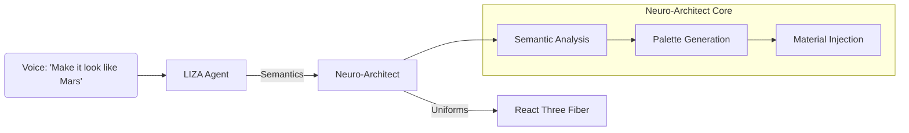

# 🎨 Neuro-Architect: The Generative Material Engine

> **Legacy Note**: References to "Theme Switching" (v3.0) are obsolete. Hektek City v6.0 uses **AI-Generative Painting**.

## Overview
The **Neuro-Architect** system allows LIZA to hallucinate material properties in real-time. Instead of swapping pre-baked textures or selecting from a list of "presets", the engine accepts semantic descriptions (e.g., "Radioactive Swamp") and translates them into raw WebGL uniform values.



## 🧠 Cognitive Material Generation

Unlike traditional game engines, we do not have "Mars Texture" or "Cyberpunk Texture" stored on disk.
We have **Base Geometries** (White-box models) that react to:

1.  **Primary Color**: The dominant architectural tone.
2.  **Accent Color**: Neon/Highlight elements.
3.  **Roughness**: How "wet" or "matte" the surface feels.
4.  **Emissive**: How much it glows.
5.  **Terrain Hint**: "Sandy", "Rocky", "Sludge".
6.  **Water Hint**: "Clear", "Toxic", "Lava".

### The `apply_visual_theme` Tool

LIZA calls this tool with a **Generated Payload**:

```json
{
  "styleName": "Generative Mars",
  "primaryColor": "#ff4500",
  "accentColor": "#ffae00",
  "roughness": 0.8,
  "metalness": 0.2,
  "terrainHint": "red_dust",
  "waterHint": "dry"
}
```

## ⚡ Performance

*   **Zero-Asset Load**: Changing a theme does **not** download new textures.
*   **<1ms Execution**: Material uniforms are updated via React state, causing an instant visual shift.
*   **Infinite Variety**: Since colors are floats, there are effectively infinite "Themes".
