# 🏗️ HekTek City: Architecture & Systems Guide

> **Note**: This guide aggregates the visual system design from previous implementations, updated for v6.0.

## 1. The Core Loop
The application is not a website; it is a **Runtime Environment**.

```mermaid
graph TD
    User[👤 User] -->|1. Input| HUD[🕹️ LizaCockpit]
    HUD -->|2. Event| EventBus[Event Loop]
    
    EventBus -->|3. Route| LIZA[AI Agent]
    EventBus -->|3. Route| Scene[3D World]
    
    LIZA -->|4. Intent| Neuro[Neuro-Architect]
    Neuro -->|5. Material Props| Scene
    
    Scene -->|6. Render frame| Canvas[WebGL Canvas]
    Canvas -->|7. Display| User
```

## 2. React Composition
Hektek City uses a "Layout-as-System" approach.

*   **`App.jsx`**: The root provider.
*   **`LizaCockpit.jsx`**: The UI overlay (Z-Index 10).
*   **`MapRPG.jsx`**: The 3D scene (Z-Index 0).

## 3. Data Flow Strategy
Our data strategy is **"Fetch Once, Hydrate Everywhere"**.

1.  **Boot**: App requests `config/exp.json` and `blog.json` from R2.
2.  **Hydrate**: Zustand store (`useStore`) is populated.
3.  **Render**: Components read from Store, not directly from API.

## 4. Visual Hierarchy
The scene is divided into layers for performance optimization:

*   **Layer 0 (Terrain)**: Low-poly LOD mesh.
*   **Layer 1 (Buildings)**: High-fidelity interactive objects.
*   **Layer 2 (Decoratives)**: Instanced meshes (Trees, signs) for mass rendering.
*   **Layer 3 (UI)**: HTML/CSS overlay.
