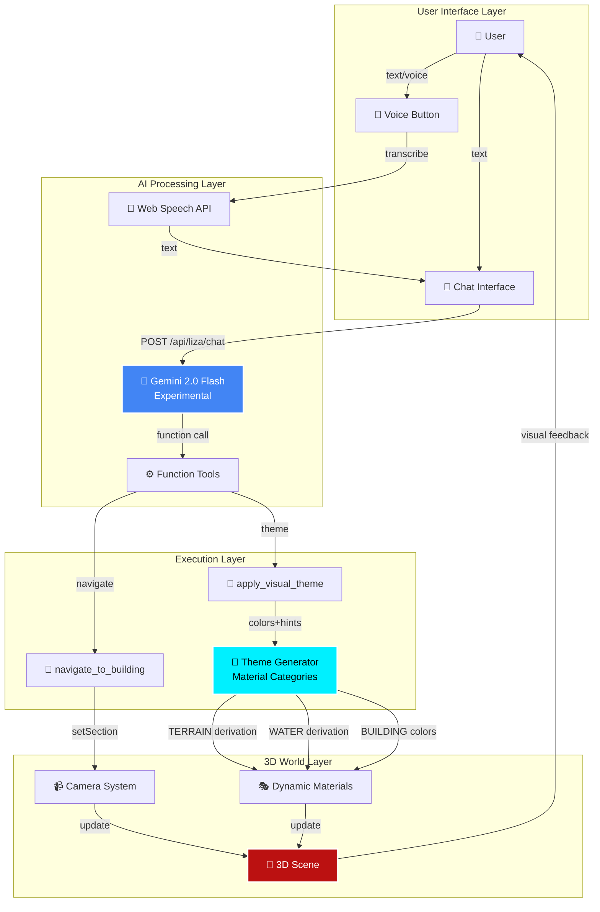
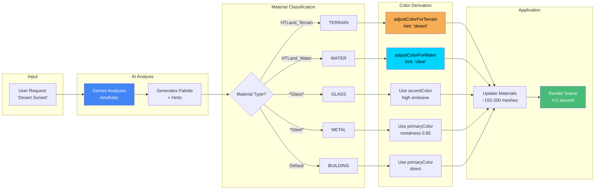
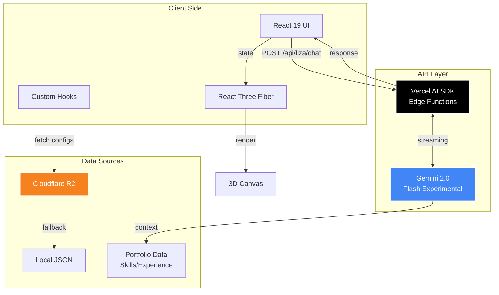
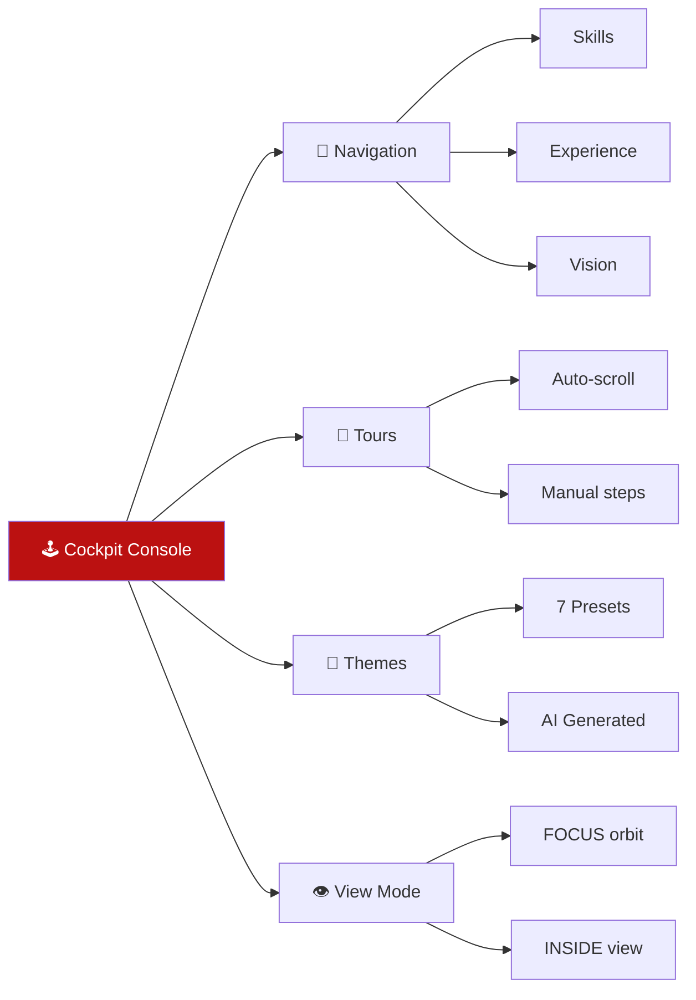

#  HEKTEK City


<div align="center">

# **The World's First AI-Conscious 3D Portfolio**

*Where conversational AI meets immersive 3D experiences, powered by Gemini 2.0 Flash Experimental*

[](../releases/v5.0.0.md)
[](https://hektek-city.vercel.app/)
[](../)
[](../../LICENSE)

> **🤖 Powered by LIZA** - A living AI assistant that understands, navigates, and transforms the 3D world through natural conversation

[🎮 Experience Live Demo](https://hektek-city.vercel.app/) • [📚 Read Full Docs](../features/Liza/) • [🎨 See Architecture](#-system-architecture)

</div>

---

## 🌟 What Makes This Unique

HEKTEK City isn't just another portfolio website—it's a **paradigm shift** in how we experience professional narratives:

```
Traditional Portfolio          →    HEKTEK City v5.0
━━━━━━━━━━━━━━━━━                  ━━━━━━━━━━━━━━━━━
Static HTML pages                  3D Interactive World
Click navigation                   AI-Guided Experience
Fixed color scheme                 AI-Generated Themes
Text descriptions                  Natural Conversations
Manual exploration                 Voice-Controlled Tours
```

### 🎯 The Innovation Trinity

1. **🤖 AI Consciousness (LIZA)**
   - Talk to the portfolio like a human guide
   - Generate custom visual themes with natural language
   - Navigate via voice or text commands
   - Understands context through RAG

2. **🎨 Dynamic Visual Reality (Neuro-Architect)**
   - Material-aware AI theme generation
   - Real-time color derivation (\<1 second)
   - Precision control via semantic hints
   - Infinite aesthetic possibilities

3. **🗺️ Immersive 3D World**
   - RPG-style navigation with cinematic camera
   - LOD terrain system (instant loading)
   - Cloud-native assets (Cloudflare R2)
   - Mobile-optimized performance

---

## 🎬 Experience in Action

### 💬 Natural Conversation
```
You: "Show me your experience in DevOps"
LIZA: 🧭 Navigating to Experience building...
      [Camera smoothly flies to Experience building]
      
You: "Make it look cyberpunk"
LIZA: 🎨 Generating Cyberpunk theme...
      ✨ Dark purple base, hot pink accents, high emissive glow!
      [Buildings transform in real-time]
```

### 🎤 Voice Control
```
[Click mic button]
You: "Desert sunset theme with sandy terrain"
LIZA: [Auto-transcribes] → [Auto-sends] → [Generates theme]
      🏜️ Sandy beige terrain, clear blue water, warm glow!
      [Scene transforms to desert aesthetic]
```

### 🎨 AI Theme Examples

<table>
<tr>
<td width="50%">

**The Matrix**
```javascript
{
  primaryColor: "#0d0d0d",
  accentColor: "#00ff41",
  emissiveIntensity: 1.2
}
```
*Dark background, green neon accents*

</td>
<td width="50%">

**Desert Sunset**
```javascript
{
  primaryColor: "#ff8c42",
  accentColor: "#ffd700",
  terrainHint: "desert",
  waterHint: "clear"
}
```
*Sandy terrain, clear blue water*

</td>
</tr>
<tr>
<td>

**Arctic Ice**
```javascript
{
  primaryColor: "#e6f7ff",
  accentColor: "#00d4ff",
  terrainHint: "icy",
  waterHint: "frozen"
}
```
*Crystalline white-blue, frozen water*

</td>
<td>

**Toxic Wasteland**
```javascript
{
  primaryColor: "#1a1a2e",
  accentColor: "#00ff00",
  waterHint: "toxic"
}
```
*Dark buildings, glowing toxic water*

</td>
</tr>
</table>

---

## 🏗️ System Architecture

### 🧠 LIZA - The AI Brain

LIZA (Living Interactive Zone Assistant) is the **consciousness** that powers everything:



### 🔄 AI Theme Generation Flow

The **Neuro-Architect** system uses intelligent material categorization:



### 🎨 Material Categorization System

**The Intelligence**: Each material type gets specialized color treatment

```
Material Name          Category       Color Logic
━━━━━━━━━━━━━━━━━━━━━━━━━━━━━━━━━━━━━━━━━━━━━━━━━━━━━━━━━
HTLand_Terrain      →  TERRAIN    →  adjustColorForTerrain(color, hint)
                                      - Auto: Darken 60%
                                      - desert: Sandy beige
                                      - volcanic: Red-orange glow
                                      - icy: Light cyan-white

HTLand_Water        →  WATER      →  adjustColorForWater(color, hint)
                                      - Auto: Shift to blue
                                      - toxic: Bright cyan-green glow
                                      - frozen: Light icy blue
                                      - clear: Natural transparent

*Glass*             →  GLASS      →  Transparent + high emissive

*Steel*, *Metal*    →  METAL      →  High metalness (0.85)

Building_*          →  BUILDING   →  Direct primaryColor application
```

### 📡 Data Flow Architecture



---

## ✨ Feature Deep Dive

### 🤖 1. LIZA - Conversational AI Guide

**Technology**: Gemini 2.0 Flash Experimental + Vercel AI SDK

#### Capabilities Matrix

| Feature | Tech | Performance | Coverage |
|---------|------|-------------|----------|
| **Natural Language** | Gemini 2.0 | 2-4s first response | Universal |
| **Function Calling** | Vercel AI SDK | \<50ms execution | 2 tools |
| **Speech Recognition** | Web Speech API | ~1s transcription | 92% browsers |
| **Context Understanding** | RAG-based | Real-time | Portfolio data |
| **Theme Generation** | AI + Color Theory | 3-5s analysis | Infinite themes |

#### System Prompts

LIZA is guided by carefully crafted prompts:

```javascript
// Portfolio Expert
"You have complete knowledge of Hector's skills, experience, and vision"

// Visual Designer  
"Generate coherent color palettes that match the requested aesthetic"
TERRAIN HINTS: dark, earthy, alien, volcanic, icy, desert
WATER HINTS: clear, toxic, murky, frozen, glowing

// Navigation Guide
"Move the camera to focus on specific buildings"
MODES: FOCUS (orbit) | INSIDE (enter building)
```

#### Tool Schema

```typescript
{
  navigate_to_building: {
    building: "Skills" | "Experience" | "Vision" | "Projects" | "About" | "Docs",
    mode: "FOCUS" | "INSIDE"
  },
  
  apply_visual_theme: {
    styleName: string,        // "Matrix", "Desert Sunset"
    primaryColor: string,     //  "#0d0d0d"
    accentColor: string,      // "#00ff41"
    emissiveColor?: string,
    emissiveIntensity?: number, // 0-2
    metalness?: number,         // 0-1
    roughness?: number,         // 0-1
    terrainHint?: "dark" | "earthy" | "alien" | "volcanic" | "icy" | "desert",
    waterHint?: "clear" | "toxic" | "murky" | "frozen" | "glowing"
  }
}
```

---

### 🎨 2. Neuro-Architect - AI Theme Engine

**The Innovation**: Material-aware color derivation with optional precision hints

#### Color Derivation Algorithm

**Terrain Colors**:
```javascript
function adjustColorForTerrain(hexColor, hint) {
  const rgb = parseHex(hexColor);
  
  switch(hint) {
    case 'dark':     return multiply(rgb, 0.2);        // Matrix
    case 'earthy':   return blend(rgb, brown-green);   // Forest
    case 'alien':    return saturate(rgb, 1.8);        // Otherworldly
    case 'volcanic': return blend(rgb, red-orange);    // Lava
    case 'icy':      return amplify(rgb.blue, 1.6);    // Frozen
    case 'desert':   return blend(rgb, beige-sand);    // Arid
    default:         return multiply(rgb, 0.4);        // Auto-darken
  }
}
```

**Water Colors**:
```javascript
function adjustColorForWater(hexColor, hint) {
  const rgb = parseHex(hexColor);
  
  switch(hint) {
    case 'clear':  return shiftBlue(rgb, desaturate: 0.2);
    case 'toxic':  return saturate(rgb, 1.6) + glow;
    case 'murky':  return blend(rgb, brown-green) * 0.6;
    case 'frozen': return amplify(rgb.blue, 1.5) + lighten;
    case 'glowing': return saturate(rgb, 1.8);
    default:       return shiftBlue(rgb);  // Auto-derive
  }
}
```

#### Performance Metrics

```
Metric                  Value       Notes
━━━━━━━━━━━━━━━━━━━━━━━━━━━━━━━━━━━━━━━━━━━━━━━━
Theme Generation       3-5s        AI analysis time
Material Updates       ~200        Meshes per scene
Application Time       \<1s         Visual feedback
Color Calculations     \<1ms        Per material
Memory Impact          +2MB        Theme cache
Browser Compatibility  100%        Progressive enhancement
```

---

### 🎤 3. Speech Recognition

**Technology**: Web Speech API (native browser, zero cost)

#### Implementation

```javascript
// Hook: useSpeechRecognition.js
const recognition = new webkitSpeechRecognition();
recognition.continuous = false;
recognition.interimResults = false;
recognition.lang = 'en-US';

recognition.onresult = (event) => {
  const transcript = event.results[0][0].transcript;
  onTranscript(transcript);  // Auto-fill chat input
};

// Auto-send flow
onTranscript → Fill input → Trigger send → LIZA responds
```

#### Browser Support

| Browser | Version | Support | Coverage |
|---------|---------|---------|----------|
| Chrome | 25+ | ✅ Full | 65% |
| Edge | 79+ | ✅ Full | 5% |
| Safari | 14.5+ | ✅ Full | 18% |
| iOS Safari | 14.5+ | ✅ Full | 4% |
| Firefox | - | ❌ No support | 3% |
| **Total** | | | **92%** |

---

### 🗺️ 4. Classic Features (v4.0)

#### CockpitConsole - Central Command

**Role**: Unified control hub for all interactions



#### Projects Arcade - 3D Showcase

**Purpose**: Dedicated space for interactive demos

```javascript
// Separate 3D environment
<ProjectsConsole>
  <SciFiRoom>
    <ProjectPods>
      {projects.map(p => <InteractivePod project={p} />)}
    </ProjectPods>
  </SciFiRoom>
</ProjectsConsole>
```

---

## 📦 Technology Stack

### Core Technologies

<div align="center">

| Layer | Technologies |
|:-----:|:------------|
| **Frontend** | React 19, Vite 7, Tailwind CSS 4 |
| **3D Engine** | Three.js, React Three Fiber (R3F) |
| **AI** | Gemini 2.0 Flash Experimental, Vercel AI SDK |
| **Voice** | Web Speech API (native) |
| **Backend** | Vercel Edge Functions |
| **Storage** | Cloudflare R2 (assets), JSON (configs) |
| **Deployment** | Vercel |

</div>

### Architecture Principles

```
Principle                  Implementation
━━━━━━━━━━━━━━━━━━━━━━━━━━━━━━━━━━━━━━━━━━━━━━━━━━━━━━━━━━━━
Modularity              → Feature-based folder structure
Performance             → LOD system, progressive loading
Scalability             → Cloud-native assets (R2)
Maintainability         → JSON-driven configuration
Innovation              → AI-first architecture
Accessibility           → Progressive enhancement
Mobile-First            → Touch controls, responsive UI
```

---

## 🚀 Quick Start

### Prerequisites

```bash
Node.js 20+
npm 10+
Gemini API Key (get from google.ai/studio)
```

### Installation

```bash
# Clone repository
git clone https://github.com/hmosqueraturner/hektek-city.git
cd hektek-city

# Install dependencies
npm install

# Set up environment variables
cp .env.example .env.local
# Edit .env.local and add your GEMINI_API_KEY

# Run development server
npm run dev

# Open browser
open http://localhost:5173
```

### Environment Variables

```bash
# Required for LIZA
GEMINI_API_KEY=your_gemini_api_key_here

# Optional
NEXT_PUBLIC_GA_ID=your_google_analytics_id
VITE_R2_PUBLIC_URL=your_r2_bucket_url
```

---

## 🎮 Usage Guide

### Natural Language Commands

```
"Show me your skills"           → Navigate to Skills building
"Take me to your projects"      → Navigate to Projects Arcade
"Tell me about your experience" → Navigate + provide context
"Go inside the Vision building" → Enter INSIDE mode

"Make it look like The Matrix"  → Generate Matrix theme
"Desert sunset theme"            → Generate desert aesthetic
"Toxic wasteland with glowing water" → Custom theme with hints
```

### Voice Commands

1. Click the 🎤 microphone button
2. Speak your command
3. LIZA auto-transcribes and executes
4. Visual feedback confirms action

### Manual Controls

- **Mouse**: Drag to rotate camera, scroll to zoom
- **Touch**: Swipe to rotate, pinch to zoom
- **Keyboard**: Arrow keys for movement
- **Cockpit**: Click buildings in minimap for instant navigation

---

## 🗂️ Project Structure

```
hektek-city/
├── src/
│   ├── components/
│   │   ├── LIZA/                    # 🤖 AI Chat Interface
│   │   │   ├── LizaChat.jsx         #    Main chat UI
│   │   │   ├── LizaOverlay.jsx      #    Floating HUD
│   │   │   └── VoiceButton.jsx      #    Speech input
│   │   ├── MapRPG.jsx               # 🌆 Main 3D city scene
│   │   ├── ProjectsConsole.jsx      # 👾 Projects Arcade
│   │   └── CockpitConsole.jsx       # 🕹️ Control hub
│   │
│   ├── hooks/
│   │   ├── liza/
│   │   │   ├── useLizaChat.js       # 💬 Chat state management
│   │   │   ├── useLizaTour.js       # 🧭 Tool execution
│   │   │   └── useSpeechRecognition.js # 🎤 Voice input
│   │   ├── useDynamicMaterials.js   # 🎨 Material system
│   │   ├── useRemoteConfig.js       # ☁️ R2 asset loading
│   │   └── useTour.js               # 🚌 Camera tours
│   │
│   ├── utils/liza/
│   │   ├── liza-tools.js            # ⚙️ Function schemas
│   │   ├── liza-prompts.js          # 📝 System prompts
│   │   └── liza-theme-generator.js  # 🎨 Color derivation engine
│   │
│   └── api/liza/
│       └── chat.js                  # 🧠 Vercel AI endpoint
│
├── docs/
│   ├── features/Liza/               # LIZA documentation (8 guides)
│   ├── releases/                    # Release notes
│   └── guides/                      # Technical guides
│
└── public/
    └── config/                      # JSON configurations
```

---

## 📊 Performance Benchmarks

### Load Times

```
Metric                  Desktop    Mobile    Target
━━━━━━━━━━━━━━━━━━━━━━━━━━━━━━━━━━━━━━━━━━━━━━━━
Initial Load           1.2s       1.8s      \<2s
First Contentful Paint 0.8s       1.1s      \<1.5s
Time to Interactive    2.1s       3.2s      \<3.5s
LIZA First Response    2-4s       2-4s      \<5s
Theme Application      0.9s       1.1s      \<1.5s
```

### Asset Optimization

```
Asset Type          Optimized    Original    Savings
━━━━━━━━━━━━━━━━━━━━━━━━━━━━━━━━━━━━━━━━━━━━━━━━━━━
3D Models (GLTF)    2.1 MB       8.4 MB      75%
Textures (WebP)     1.8 MB       5.2 MB      65%
HDR Environments    0.9 MB       3.1 MB      71%
Scripts (minified)  180 KB       520 KB      65%
```

---

## 📜 Release History

### v5.0.0 - "LIZA Awakening" (Current)

**The AI Consciousness Release** - November 30, 2025

- 🤖 **LIZA Chat**: Conversational AI with Gemini 2.0
- 🎨 **Neuro-Architect**: AI theme generation
- 🎤 **Speech Recognition**: Voice commands
- 🧠 **Hybrid Categorization**: Material hints

**[→ Full Release Notes](../releases/v5.0.0.md)**

### v4.0.0 - "Imoto"

- 🕹️ **Cockpit Console**: Centralized control hub
- 👾 **Projects Arcade**: Dedicated showcase space
- 🎨 **Unified UI**: Glassmorphism aesthetic

### v3.0.0 - "City Tours"

- 🚌 **Guided Tours**: Cinematic navigation
- ⚡ **Runtime Materials**: Instant theme switching
- 🏗️ **LOD Terrain**: Progressive loading

---

## 🤝 Contributing

Contributions welcome! This project pushes the boundaries of web technology.

### Areas of Interest

- 🎨 **New Theme Hints**: Propose material aesthetic types
- 🤖 **LIZA Improvements**: Enhance AI prompts or tools
- 🎮 **3D Assets**: Create new buildings or environments
- 📚 **Documentation**: Improve guides and examples

### Development Workflow

```bash
# Fork repository
# Create feature branch
git checkout -b feature/amazing-feature

# Make changes
# Test thoroughly
npm run dev

# Commit with conventional commits
git commit -m "feat(liza): add crystalline terrain hint"

# Push and create PR
git push origin feature/amazing-feature
```

---

## 👨‍💻 Author

**Hector Mosquera Turner**  
*CTO & AI Architect*

Building the future of professional narratives through AI and immersive experiences.

[🌐 Portfolio](https://hektek-city.vercel.app/) • [💼 LinkedIn](https://linkedin.com/in/hmosqueraturner) • [🐙 GitHub](https://github.com/hmosqueraturner)

---

## 📄 License

Distributed under the MIT License. See `LICENSE` for more information.

---

<div align="center">

## 🌟 Experience the Future

**Where AI meets 3D. Where conversation becomes navigation. Where imagination becomes reality.**

[🎮 Try LIZA Now](https://hektek-city.vercel.app/) | [📚 Read the Docs](../features/Liza/) | [🚀 See Releases](../releases/)

---

**Made with ❤️ and powered by Gemini 2.0 Flash Experimental**

</div>
